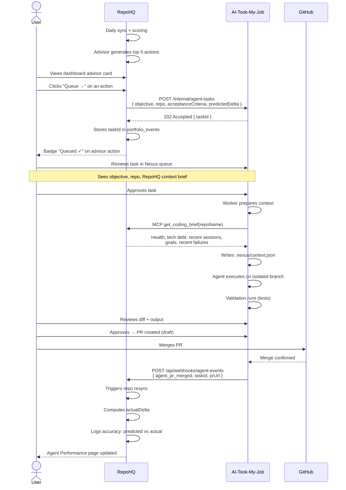
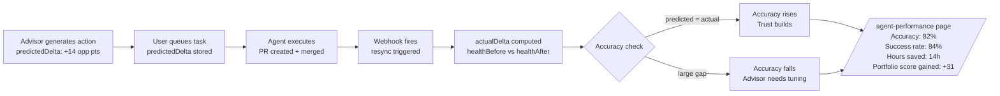
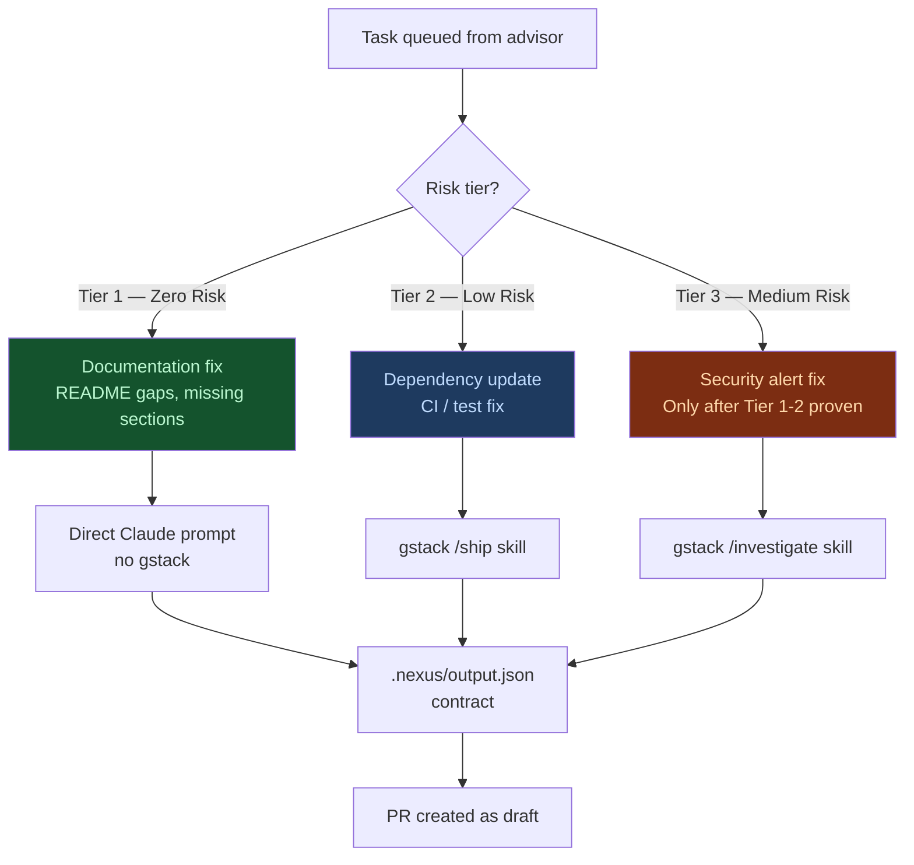
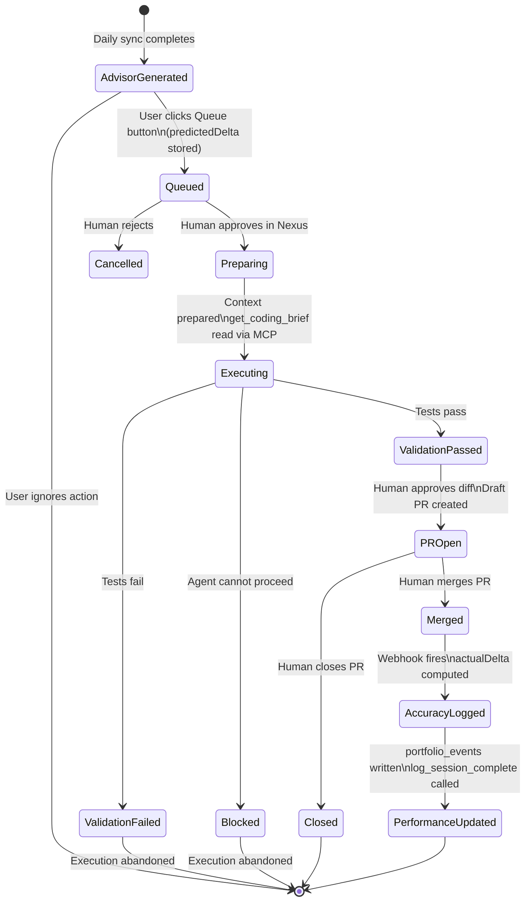
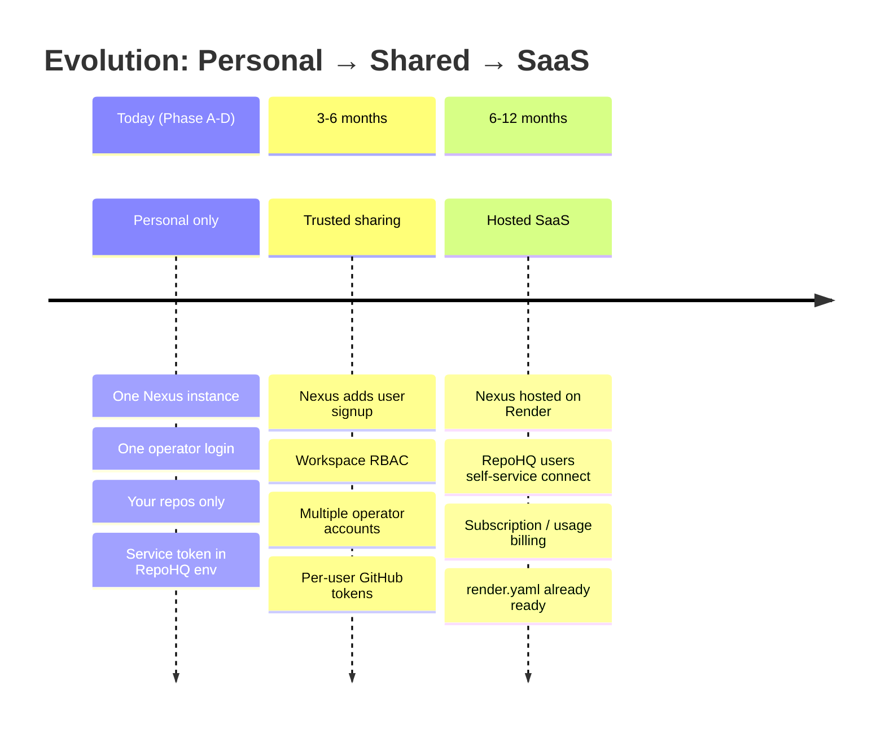

# Agentic Execution Flow — RepoHQ × AI-Took-My-Job

Visual reference for the architecture and user flows in Phase 46.

---

## System Architecture

```mermaid
graph TB
    subgraph RepoHQ["RepoHQ (Intelligence Layer)"]
        GH[GitHub Sync]
        SCORE[Health / Opportunity\nScoring Engine]
        ADVISOR[AI Advisor\nTop 5 Quantified Actions]
        SIM[Simulation Engine\nPlan My Week]
        DASH[Dashboard\n+ Advisor Card]
        MCP[MCP Server\nget_coding_brief\nget_next_action\nlog_session_complete]
        PERF[Agent Performance\nPage]
        DB[(Neon PostgreSQL\nportfolio_events\nhealth_score_history)]
        HOOK[Webhook Handler\n/api/webhooks/agent-events]
    end

    subgraph Nexus["AI-Took-My-Job / Nexus (Execution Layer)"]
        QUEUE[Review Queue\nOperator UI]
        WORKER[BullMQ Worker]
        AGENT[Claude Agent\nisolated branch]
        VALID[Validation\nnpm test / replay]
        PR[GitHub PR\ndraft by default]
    end

    subgraph Inputs["Input Channels"]
        EXT[Chrome Extension\nUser bug reports]
        RBTN[Queue Button\nAdvisor actions]
    end

    subgraph gstack["gstack Skills"]
        INV[/investigate]
        SHIP[/ship]
    end

    GH --> SCORE --> ADVISOR --> DASH
    DASH --> RBTN
    RBTN -->|POST /internal/agent-tasks\npredictedDelta| QUEUE
    EXT -->|POST /webhooks/extension| QUEUE

    QUEUE -->|human approves| WORKER
    WORKER -->|reads context| MCP
    MCP -->|get_coding_brief| WORKER
    WORKER --> AGENT

    AGENT --> INV
    AGENT --> SHIP
    AGENT --> VALID
    VALID --> PR

    PR -->|merged| HOOK
    HOOK -->|actualDelta computed| DB
    HOOK -->|accuracy logged| PERF
    HOOK -->|resync triggered| GH

    MCP --> DB
    AGENT -->|log_session_complete| MCP

    style RepoHQ fill:#1e1b4b,stroke:#6366f1,color:#e0e7ff
    style Nexus fill:#1a2744,stroke:#3b82f6,color:#dbeafe
    style Inputs fill:#1a2e1a,stroke:#22c55e,color:#dcfce7
    style gstack fill:#2d1a1a,stroke:#f59e0b,color:#fef3c7
```

---

## User Flow — Phase A (The Bridge)



---

## Phase A.5 — Accuracy Feedback Loop



---

## Task Risk Tiers — Phase C Routing



---

## Full Lifecycle (Phases A–D)



---

## Multi-User Path (Future — Not Phase A-D)


