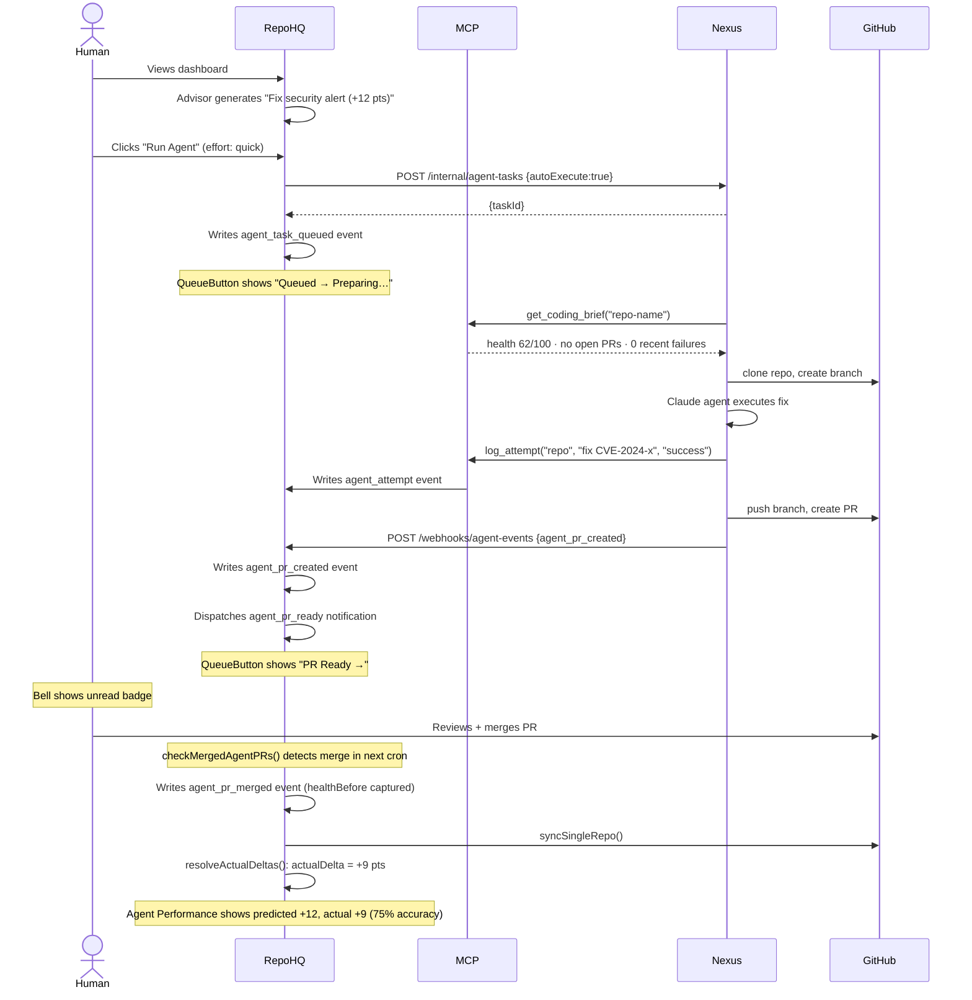
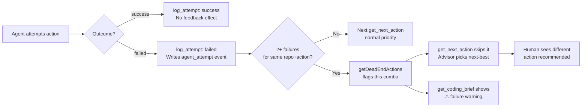
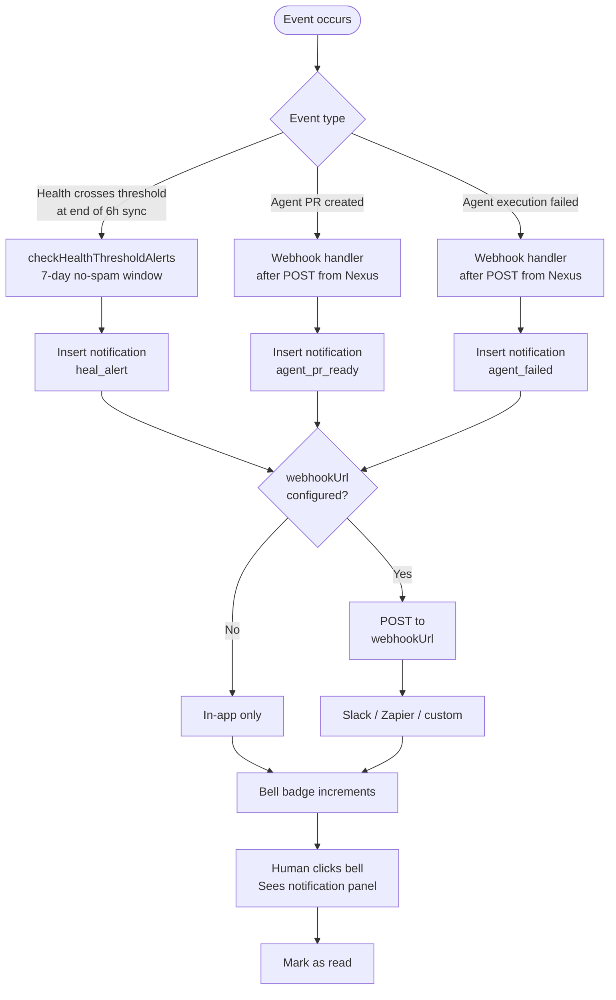
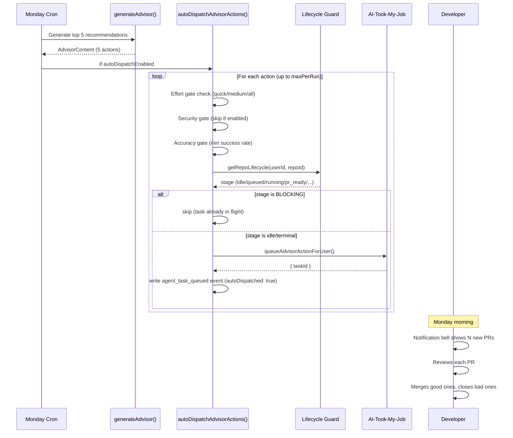
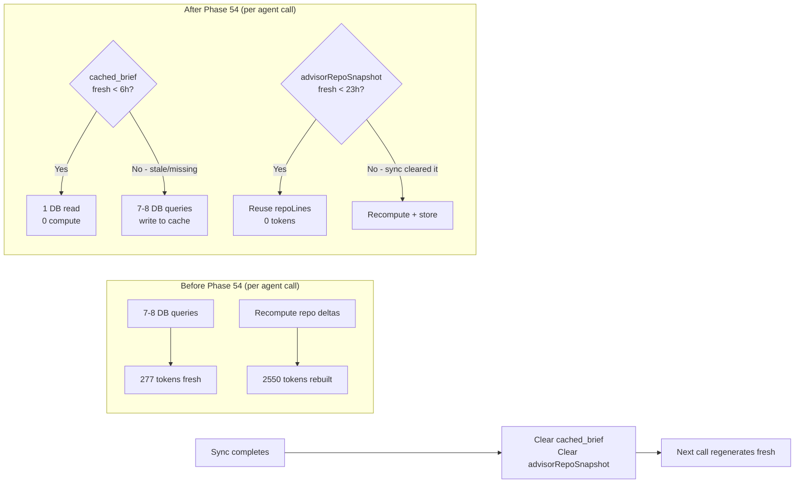

# RepoHQ — Full Agentic Flow (Phases 46–54)

Complete visual reference for the automated portfolio improvement pipeline as of Phase 54.

---

## End-to-End System Architecture

```mermaid
graph TB
    subgraph RepoHQ["RepoHQ (Intelligence Layer)"]
        direction TB
        GH[GitHub Sync\nevery 6h]
        SCORE[Health Scoring Engine\nactivity · security · docs · build]
        ADVISOR[AI Advisor\nquantified actions + predicted delta]
        DASH[Dashboard\nAdvisorCard + QueueButton]
        DB[(Neon PostgreSQL\nrepositories · portfolio_events\nnotifications · health_score_history)]

        subgraph MCP["MCP Server (Agent Context)"]
            MB1[get_coding_brief\nhealth · in-flight · attempts]
            MB2[get_next_action\nskips open PRs + dead ends]
            MB3[log_attempt\noutcome feedback]
            MB4[log_session_complete]
            MB5[get_active_work\ncollision prevention]
        end

        subgraph NOTIFY["Push Notifications (Phase 49)"]
            BELL[In-app Bell\nunread badge + sheet]
            HOOK_OUT[Webhook Dispatcher\nSlack · Zapier · custom]
            HEALTH_ALERT[Health Threshold Alerts\nper-user threshold in Settings]
        end

        subgraph OBSERVE["Observability (Phase 47–48)"]
            PERF[Agent Performance Page\n/agent-performance]
            FEED[Portfolio Feed\nagent events inline]
            BADGE[Repo List PR badge\nopen → GitHub link]
            HISTORY[Repo Detail Agent tab\nattempts · PRs · actual delta]
        end

        MERGE[PR Merge Detector\ncheckMergedAgentPRs]
        DELTA[Delta Resolver\nresolveActualDeltas]
        HOOK_IN[Webhook Handler\n/api/webhooks/agent-events]
    end

    subgraph Nexus["AI-Took-My-Job / Nexus (Execution Layer)"]
        direction TB
        API[Internal API\n/internal/agent-tasks]
        WORKER[BullMQ Worker\nauto-execute pipeline]
        AGENT[Claude Agent\nisolated branch]
        VALID[Validation\ntests pass?]
        PROMOTE[PR Promotion\ndraft:false]
    end

    GH -->|repos + metrics| SCORE
    SCORE -->|health scores| ADVISOR
    ADVISOR -->|top actions| DASH
    DASH -->|"Run Agent"| API
    API -->|taskId| DB
    API --> WORKER
    WORKER -->|get_coding_brief| MB1
    MB1 -->|context| AGENT
    AGENT -->|changes| VALID
    VALID -->|pass| PROMOTE
    PROMOTE -->|agent_pr_created webhook| HOOK_IN
    HOOK_IN -->|write event| DB
    HOOK_IN -->|"agent_pr_ready notification"| HOOK_OUT
    HOOK_IN -->|after()| MERGE
    MERGE -->|healthBefore| DB
    GH -->|resync| DELTA
    DELTA -->|actualDelta patch| DB
    DELTA -->|agent_pr_merged event| PERF
    WORKER -->|agent_failed webhook| HOOK_IN
    HOOK_IN -->|"agent_failed notification"| HOOK_OUT
    HOOK_OUT --> BELL
    HOOK_OUT -->|POST| SLACK[Slack / Zapier]
    GH -->|after sync| HEALTH_ALERT
    HEALTH_ALERT -->|health_alert| BELL
    AGENT -->|log_attempt| MB3
    MB3 -->|agent_attempt event| DB
    DB -->|attempt history| MB1
    MB2 -->|skip repos with open PRs| ADVISOR
    MB2 -->|skip dead ends| ADVISOR
    DB --> FEED
    DB --> BADGE
    DB --> HISTORY
    DB --> PERF
```

---

## Automated Execution Sequence (Happy Path)



---

## Dead-End Detection & Feedback Loop (Phase 51)



---

## Notification Flow (Phase 49)



---

## MCP Tool Summary (Phase 45–51)

| Tool | Phase | Purpose |
|------|-------|---------|
| `get_portfolio_summary` | 45 | Overview: score, focused repos, top advisor actions |
| `get_repo_context` | 45 | Deep context for a specific repo |
| `get_portfolio_warnings` | 45 | Failing builds, security alerts, health drops |
| `get_top_opportunities` | 45 | Repos by opportunity score |
| `get_active_goals` | 45 | Goals with progress |
| `get_coding_brief` | 45–51 | Full session-start doc: health, in-flight, attempts, sessions |
| `get_next_action` | 45–51 | Top ROI action; skips open PRs + dead ends |
| `log_session_complete` | 45 | Records what was done (human-authored session note) |
| `get_active_work` | 50 | Open agent PRs per repo or portfolio-wide; safe-to-start flag |
| `log_attempt` | 51 | Records attempt outcome; feeds dead-end detection |

---

## Auto-Dispatch Flow (Phase 53 — Monday Morning PRs)



## Token Efficiency (Phase 54)



## MCP Tool Summary (Phase 45–54)

| Tool | Phase | Purpose |
|------|-------|---------|
| `get_portfolio_summary` | 45 | Overview: score, focused repos, top advisor actions |
| `get_repo_context` | 45 | Deep context for a specific repo |
| `get_portfolio_warnings` | 45 | Failing builds, security alerts, health drops |
| `get_top_opportunities` | 45 | Repos by opportunity score |
| `get_active_goals` | 45 | Goals with progress |
| `get_coding_brief` | 45–54 | Full session-start doc; served from cache within 6h |
| `get_next_action` | 45–54 | Top ROI action; skips open PRs + dead ends; confidence line |
| `log_session_complete` | 45 | Records what was done |
| `get_active_work` | 50 | Open agent PRs; safe-to-start flag |
| `log_attempt` | 51 | Records attempt outcome; feeds dead-end detection |
| `get_accuracy_report` | 52 | Advisor calibration table + downgraded repos |
