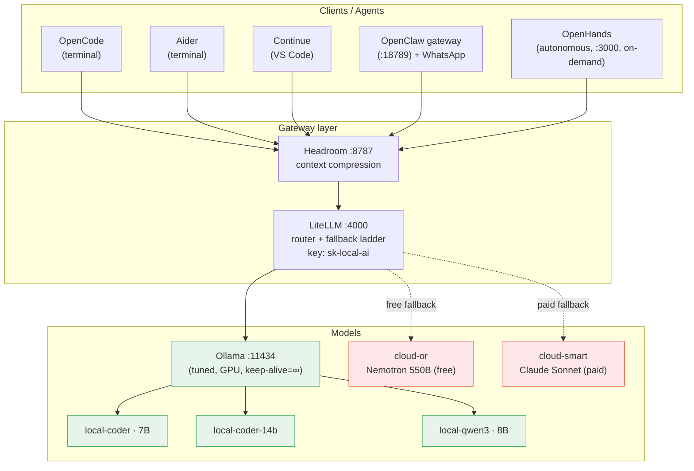

# Personal AI Platform

A self-hosted, **`$0`-by-default** local AI platform running on a single **MacBook Pro M1 Pro (16 GB)** — a unified coding stack plus a private personal assistant, with optional cloud "escape hatches" for hard tasks.

> **Status:** operational. One endpoint for every agent, local-first with capped cloud fallback, reboot-resilient.

These docs moved here from the `smithdavedesign/ai-stack-docs` repository on 2026-10-07 (from its last commit, `112de4f`), next to the RepoHQ factory that runs on this stack. The factory uses this stack's LiteLLM gateway, local models and free-model pool ([factory/README.md](../../factory/README.md)), and OpenClaw's front door feeds it requests ([agent-hq-migration-prd.md](../agent-hq-migration-prd.md)). The live configuration stays on the Mac, in `~/ai-stack/` and `~/.openclaw/` (see [Where things live](#where-things-live)).

---

## What's in it

- **Coding stack** — terminal + IDE agents backed by local models, with a free-model pool + cloud fallback ladder. → [coding-stack.md](coding-stack.md)
- **Personal assistant** — a private, memory-rich companion on WhatsApp (Dot/Muse-style), only for the owner, with **full agentic access** (writes code + runs commands in any repo) and **live integrations** (GitHub, Gmail, Calendar, Notes/Reminders, Notion). → [personal-assistant.md](personal-assistant.md)
- **One gateway** — every agent talks to a single OpenAI-compatible endpoint; routing, fallback, and context-compression happen behind it.

---

## System architecture



**Request path:** `agent → Headroom (:8787) → LiteLLM (:4000) → Ollama (:11434) or cloud`
**Single endpoint:** `http://localhost:4000/v1` (or `:8787/v1` through Headroom) · **auth key:** `sk-local-ai`

---

## Components

| Layer | Component | Role | Port | Detail |
|---|---|---|---|---|
| Runtime | **Ollama** | Local model server (tuned) | `11434` | [coding-stack](coding-stack.md#ollama) |
| Compression | **Headroom** | Shrinks context before the model | `8787` | [coding-stack](coding-stack.md#headroom) |
| Router | **LiteLLM** | One API, routing, fallback ladder | `4000` | [coding-stack](coding-stack.md#litellm) |
| Agent (CLI) | **OpenCode / Aider** | Terminal coding | — | [coding-stack](coding-stack.md#agents) |
| Agent (IDE) | **Continue** | VS Code coding/chat | — | [coding-stack](coding-stack.md#agents) |
| Agent (auto) | **OpenHands** | Autonomous multi-step tasks | `3000` | [coding-stack](coding-stack.md#openhands) |
| Assistant | **OpenClaw** | WhatsApp companion + gateway | `18789` | [personal-assistant](personal-assistant.md) |

---

## Documentation

| Doc | Contents |
|---|---|
| [Architecture](architecture.md) | All diagrams: topology, request flow, routing, companion, resilience |
| [Coding stack](coding-stack.md) | Ollama, Headroom, LiteLLM, models, agents, OpenHands |
| [Personal assistant](personal-assistant.md) | Companion persona, memory, proactivity, channels, cost |
| [Operations](operations.md) | Runbook, health checks, reboot resilience, troubleshooting |
| [Reference](reference.md) | Ports, paths, models, secrets, external links |
| [Roadmap](roadmap.md) | Where it's headed — horizons, status, deliberate no's |
| [Authentication](authentication.md) | How each integration authenticates + staying logged in |

---

## Quick start

```bash
# health check (every layer)
curl -s localhost:4000/v1/models -H "Authorization: Bearer sk-local-ai"   # LiteLLM
curl -s localhost:8787/v1/models -H "Authorization: Bearer sk-local-ai"   # Headroom → LiteLLM
ollama ps                                                                 # UNTIL should say "Forever"

# use it
opencode                                   # terminal agent (default local-coder)
aider --model openai/cloud-smart           # one-off with the paid model
# WhatsApp: just message the companion
```

Full runbook: [operations.md](operations.md).

---

## Hard constraints (16 GB machine)

- 7–8B models comfortable; **14B only at 8k context**; 30B impossible.
- **Never** run a large local model *and* OpenHands at once.
- First request after idle/restart cold-prefills (~80 s once), then warm (~1–2 s).

---

## Where things live

| What | Where |
|---|---|
| These docs | `docs/ai-stack/` in Github-HQ (formerly the `ai-stack-docs` repository, retired 2026-10-07) |
| Live stack configuration | `~/ai-stack/` on the Mac, its own local git repo; secrets in gitignored files |
| OpenClaw state and the companion's memory | `~/.openclaw/` on the Mac (contains secrets; never commit) |
| The factory that uses the stack | [`factory/`](../../factory/README.md) in Github-HQ |
| The OpenClaw ↔ factory contract | `~/ai-stack/repohq/CONTRACT.md` (OpenClaw side) and [`factory/lib/owner-requests.ts`](../../factory/lib/owner-requests.ts) (factory side) |
