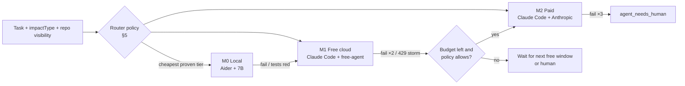
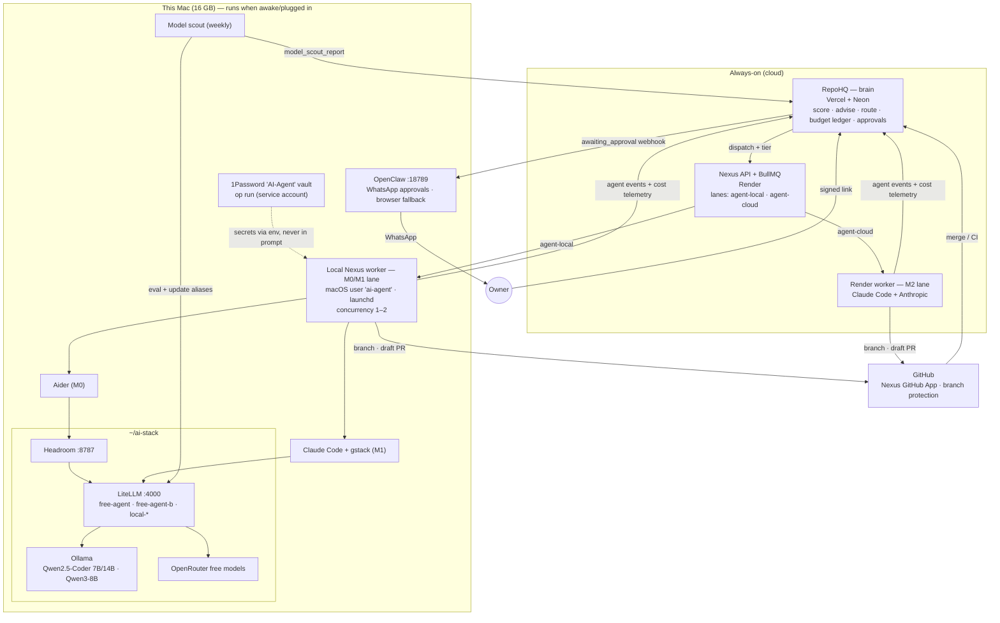

# RepoHQ — Personal Autonomous Software Factory

> **Status:** Phases 60–64, 68 and 69 shipped; 65–66 partial; 67 not started ([roadmap.md](roadmap.md#autonomous-factory-roadmap)).
> The local lane runs as `factory/` on a launchd schedule (hourly overnight, 06:45 morning report); operator guide in [factory/README.md](../factory/README.md).
> Agent work lands on `integration/agent`; only human-labelled releases reach `main` (roadmap Phase 70).
> §12 records what building it changed, including the first scheduled night.
> Adapted from the *"Personal Autonomous Software Factory — Infrastructure Provisioning & Identity"* PRD (§21),
> reconciled with what RepoHQ, Nexus, gstack and the local AI stack actually do today, and
> re-prioritised around one constraint: **use free models wherever they're good enough.**

---

## 0. TL;DR

RepoHQ already runs a closed improvement loop: **score → advise → dispatch → execute → PR → measure → recalibrate**
(see [agentic-full-flow.md](agentic-full-flow.md)). Every execution today runs on **paid Claude** on a Render worker.

This doc turns that loop into a **cost-aware autonomous factory**:

1. **A local worker lane on the Mac** executes most tasks against the local AI stack (`~/ai-stack`: Ollama → Headroom → LiteLLM), at **$0**.
2. **A model-tier ladder** (local → free cloud → paid) picks the cheapest model that has *proven* it can do each task type, and escalates on failure.
3. **The existing accuracy loop is extended to models**, so the system learns its own routing policy. That is self-improvement of the factory, as well as of the repos.
4. **Trust, secrets, identity and budget guardrails** from the PRD get mapped onto existing RepoHQ primitives instead of a parallel system.
5. **Infrastructure provisioning** (the PRD's headline) is kept, but moved to Horizon 3. It's high-blast-radius and only pays off once the repo loop is cheap and trusted.

---

## 1. What exists today (verified 2026-10-04)

| Layer | Component | Where | State |
|---|---|---|---|
| Brain | **RepoHQ** (this repo): scoring, advisor, auto-dispatch, accuracy loop, MCP | Vercel + Neon | ✅ shipped (Phases 1–59) |
| Dispatcher | **Nexus** (`AI-Took-My-Job`): API + BullMQ queue `triage` | Render (web + Redis) | ✅ |
| Hands (paid) | Nexus worker → `scripts/gstack-*.sh` → `claude /skill --print` | Render worker, `ANTHROPIC_API_KEY` | ✅ (see bug note below) |
| Skills | **gstack**: `/health /qa-only /review /investigate /ship /qa /canary /document-release /retro` | `~/.claude/skills/gstack` | ✅ |
| Model gateway | **ai-stack**: Ollama :11434 → Headroom :8787 → LiteLLM :4000 (`sk-local-ai`) | this Mac, auto-start | ✅ all layers green |
| Local models | `local-coder` (Qwen2.5-Coder-7B), `local-coder-14b` (8k ctx), `local-qwen3` | Ollama | ✅ $0 |
| Free cloud | `cloud-or` (OpenRouter `nemotron-3-ultra-550b:free`) | LiteLLM | ✅ $0, rate-limited |
| Paid cloud | `cloud-smart` (Claude Sonnet) | LiteLLM | ✅ pay-per-use |
| Agent CLIs | Claude Code 2.1, Aider 0.86, OpenCode 1.18, OpenHands (on-demand) | this Mac | ✅ |
| Assistant | **OpenClaw** gateway :18789 + WhatsApp companion | this Mac, launchd | ✅ |
| Secrets | 1Password CLI `op` 2.33 | this Mac | installed, not wired |
| IaC | Terraform 1.5.7, `gh` (authed) | this Mac | installed |
| Agent identity (GitHub) | Nexus `GITHUB_AUTH_MODE=app` (GitHub App) | Render | ✅ (PRs come from the app) |

> **Bug found during this review (fixed on `AI-Took-My-Job` branch `fix/gstack-claude-invocation`, with a regression test; not yet deployed):** commit `1e9210e`
> ("remove OpenClaw") left the `claude --print` call *inside the `else` branch* of all nine
> `scripts/gstack-*.sh`. On any machine where `claude` is on `PATH`, which includes Render after
> `npm install -g @anthropic-ai/claude-code`, the skill never ran. Report-only skills then produced
> empty reports ("clean runs"). After the fix, `tests/integration/gstack-health-readonly-check.sh`
> passes with real findings.

### Spike: can free models drive the loop? (2026-10-04)

Same task each time: a seeded bug in `add()`, "read it, fix it, reply DONE".

| Harness → model | Path | Result | Time | Cost |
|---|---|---|---|---|
| **Aider → `local-coder` (7B)** | `OPENAI_API_BASE=localhost:4000/v1` | ✅ fixed | **8.7 s** (651 tokens) | $0 |
| **Claude Code → `cloud-or` (free)** | `ANTHROPIC_BASE_URL=localhost:4000` (LiteLLM `/v1/messages`) | ✅ Read → Edit tool loop, fixed | 65 s | $0 |
| Claude Code → `local-coder` (7B) | same | ❌ "Prompt is too long": Claude Code's system prompt + tools exceed 16k ctx | — | — |

Conclusions that drive the design:

- **LiteLLM's Anthropic-compatible `/v1/messages` endpoint means Claude Code + gstack can run on free models unchanged.** You set three env vars and touch no code.
- **Local 7–14B models can't host Claude Code** (context), but **Aider's lean prompts make them useful** for scoped, file-targeted edits.
- OpenRouter currently lists **19 free models with tool-calling** (`supported_parameters` ∋ `tools`). Slugs rotate, so the factory needs a *scout* (§6) and should never hard-code a slug.

---

## 2. Changes from the original PRD

| PRD section | Change | Why |
|---|---|---|
| §21 overall order | **Repo self-improvement first, infra provisioning later** (Horizon 3) | The value and the learning signal (PR merged → health delta) already exist for repos. Provisioning cloud resources is the highest blast radius and has no accuracy signal yet. |
| *(missing)* | **New §3: model-tier routing + cost ladder** | The PRD has budgets but no model strategy. Free-first is the core requirement. |
| *(missing)* | **New §4: data-classification policy** | Free cloud endpoints may log or train on prompts. Private-repo code shouldn't go there by default. |
| *(missing)* | **New §5: learned routing** | Turns the existing advisor-accuracy loop into a model-selection loop. That's the "self-improvement" with a real signal. |
| §21.4 four trust levels | **Kept; crossed with the existing task tiers** (Tier 1–3/Blocked) and environments | RepoHQ already gates by task tier. Action level and task tier are orthogonal and both are needed. |
| §21.4 Level 4 | **Exception: an agent may destroy what it created in the same run, tagged `ephemeral`, in dev** | Otherwise disposable environments (§21.13) need a human click on every teardown, which defeats them. |
| §21.14 VM architecture | **No VM on a 16 GB Mac.** A dedicated macOS user first, container later | A VM plus Ollama plus Docker (capped at 7.65 GB) doesn't fit. Unix-user isolation costs zero RAM. |
| §21.15 network isolation | **Deferred to the container phase**, plus a cheap rule now: worker reaches LiteLLM, GitHub, registries | Egress allowlisting on Docker Desktop needs a proxy, which is more memory. |
| §21.17 Director / PM / Architect agents | **Stages in one pipeline, not separate long-running agents** | Inter-agent chatter burns tokens. RepoHQ advisor = Director/PM; gstack `plan-*` reviews = Architect; Nexus = dispatcher. |
| §21.9 OpenClaw | **Re-admitted as the human channel + browser fallback, *not* the execution path** | Phase 58-G removed it from execution for good reasons (WebSocket gateway, local-only). It's now running locally and is ideal for WhatsApp approvals. |
| §21.11 budgets | **Add "no silent paid fallback" rule**; RepoHQ (Neon) is the budget ledger | LiteLLM's `local-coder → cloud-or → cloud-smart` ladder auto-spends on error. LiteLLM budgets need their own Postgres (no RAM for it). |
| §21.2 `.infrastructure/` folder | **Ledger lives in RepoHQ DB; the repo folder is a mirror** | One queryable source of truth across repos for cost, TTL and teardown. |
| §21.21 relationship | Updated with real components (§8) | |

---

## 3. Model tiers and the cost ladder

Every task is assigned a **model tier** before dispatch. The dispatcher always starts at the cheapest eligible tier.

| Tier | Harness → model | Cost | Good for | Not for |
|---|---|---|---|---|
| **M0 Local** | **Aider** → `local-coder` / `local-coder-14b`; direct LiteLLM calls → `local-qwen3` | $0, unlimited | README/doc sections, single-file fixes with a known target, commit/PR text, classifying findings, summarising CI logs | Anything needing repo exploration or tool loops; >16k context (8k for 14B) |
| **M1 Free cloud** | **Claude Code + gstack** with `ANTHROPIC_BASE_URL=http://localhost:4000` → alias `free-agent`, a **redundant pool across three free providers** (§3.1) | $0; each provider rate-limited, the pool isn't | gstack report-only skills (`/health /review /qa-only /retro`), Tier 1–2 `/ship` (docs, deps, CI/test fixes) on **public** repos | Private repos (default, §4); Tier 3 security; long-context refactors |
| **M2 Paid** | Claude Code → Anthropic (`cloud-smart` or direct key) | $ | Tier 3 (`/investigate` security), tasks that failed twice on M1, private repos where free is disallowed | Default path. **Never reached implicitly.** |

**The RepoHQ intelligence layer** (advisor, digest, CEO report, summaries) runs on Vercel and can't reach `localhost`. It gets its own free path:

- **Gemini free tier**: the existing `gemini` adapter already works with a free AI Studio key. Zero code.
- **OpenRouter free models** via a new OpenAI-compatible `openrouter` provider (base URL + model in settings). Locally the same provider can point at LiteLLM.
- Free models are worse at strict JSON. Every structured call gets **schema validation → one repair retry → fallback to `claude-haiku-4-5`**, and fallbacks are counted toward budget.

### 3.1 The free model pool: no single quota is a point of failure

A $0 OpenRouter account gets **50 free-model requests per day**, and one Claude Code task uses about 10–30. Building M1 on OpenRouter alone made the whole free tier stop after two tasks (it did, on day one). M1 is therefore a **pool** inside LiteLLM, spread across independent free providers, and every client goes through LiteLLM rather than talking to a provider directly:

```
          Factory (Claude Code / Aider)      OpenClaw agents      OpenCode · Aider · Continue
                       │                           │                        │
                       └───────────── Headroom → LiteLLM :4000 ─────────────┘
                                             │
        local-coder / local-agent ── Ollama on the M1 Pro ($0, unlimited) ← routine work
                                             │ error
        free-agent ── Ollama Cloud (free plan) ─429→ free-agent-b ── OpenRouter :free ─429→ free-agent-c ── Gemini (AI Studio free)
                                             │ all exhausted
        factory: defer to next cycle (never pays)        interactive / OpenClaw: cloud-smart (paid, last resort)
```

| Policy (owner's) | Alias | Where it runs |
|---|---|---|
| Routine: classify, summarise, read an error, small scoped edits | `local-coder` / `local-agent` | Ollama on the Mac, $0, unlimited |
| Medium: agentic coding, reviews, multi-file fixes | `free-agent` → `-b` → `-c` | Free pool: Ollama Cloud · OpenRouter · Gemini, chosen by the scout |
| OpenRouter | member of the pool | One provider among three, no longer the brain |
| Hard / production-critical | `cloud-smart` | Paid Claude: explicit choice, budget-gated in the factory, last resort for interactive use |

- **The scout picks members by eval, not by brand.** It discovers free candidates on each provider: Gemini models that answer right now (newest Flash models often return 503 "high demand" on the free tier); Ollama Cloud models available on the free plan *with tool calling*, probed per model since many are Pro-only; and OpenRouter `:free` models with `tools`. It runs the eval suite on each, ranks with 21 days of history, and fills the chain **best model first, then different providers** (`pickPool`). It doesn't re-test models evaluated in the last 3 days.
- **Fallback is LiteLLM's job, inside one request.** A 429 on one provider moves to the next without the caller noticing. Verified live: a request to quota-exhausted `cloud-or` came back from Ollama Cloud with `x-litellm-attempted-fallbacks: 1`. LiteLLM doesn't chain fallbacks recursively, so every ladder (`free-agent`, `cloud-or`, `local-coder`) is written out in full by the scout.
- **The factory only defers M1 when no member has capacity.** OpenRouter's quota is the only one it can read (`/api/v1/key`), so a pool with any other provider proceeds and relies on LiteLLM to fall through (`m1Deferred`).
- **OpenClaw** already talked to LiteLLM through Headroom. Its default agent is now `local-coder` → `free-agent` → `cloud-smart` instead of `local-coder` → `cloud-or` → `cloud-smart`. The companion agent stays on `cloud-smart` by choice.
- **Data policy is unchanged.** Every pool member is a free tier that may log or train on prompts (Google states this for the AI Studio free tier), so the §4 rule stands: only public repos reach M1 unless a private repo opts in.

### Escalation ladder



Each escalation carries the failed attempt's diff and test output as context, the same mechanism as the Phase 55 CI-fix loop.

### Rules

1. **No silent paid fallback.** Worker aliases (`free-agent`, `local-*`) have **free-only** fallbacks in LiteLLM. Only the dispatcher can pick M2, and only with budget.
2. **429 is "wait", not "escalate".** Free-tier rate limits reschedule the job with backoff. Escalating on rate limits would turn throttling into spend.
3. **Model is telemetry.** Every attempt records `{tier, harness, model, inputTokens, outputTokens, costUsd, durationMs}`.

---

## 4. Data classification

| Repo class | M0 local | M1 free cloud | M2 paid |
|---|---|---|---|
| Public | ✅ | ✅ | ✅ |
| Private (default) | ✅ | ❌ (opt-in per repo: `allowFreeCloud`) | ✅ |
| Private + flagged sensitive (secrets, client work) | ✅ | ❌ | ✅ (zero-retention account only) |

RepoHQ already stores `visibility` and `purpose` (e.g. `Client Work`), so the default needs no new input. Free provider terms change; the scout (§6) records each model's data-policy flag where OpenRouter exposes it.

---

## 5. Learned routing: the factory improves itself

RepoHQ already computes per-`impactType` accuracy (`advisor-accuracy-utils.ts`) from `portfolio_events`. Extend the key from `impactType` to **`(impactType, skill, tier)`**:

```
success(impactType, skill, tier) = merged PRs with actualDelta ≥ 0  /  attempts   (30-day decay, as today)
```

**Router policy** (pure function, `src/lib/agents/model-router.ts`):

1. Candidate tiers = tiers allowed by data policy (§4) and task tier (Tier 3 → M2 only, until M1 proves itself on Tier 2).
2. Pick the **cheapest tier with success ≥ 80% over ≥ 10 attempts**.
3. If no tier has enough data, start at the cheapest allowed tier (cold start is free).
4. **Exploration:** about 10% of eligible tasks are tried **one tier cheaper** than policy says. That's how the system notices a new free model got good. Capped so an exploration failure always has a cheaper retry budget.
5. Downgrade is automatic; upgrade-to-paid needs budget (§7).

This gives the PRD's "measure → learn → next mission" a concrete number: **% of merged improvements produced at $0**.

---

## 6. Model scout (weekly, $0)

Free slugs rotate (the ai-stack README already documents `cloud-or` 404s). A weekly local job:

1. `GET https://openrouter.ai/api/v1/models` → filter `pricing.prompt == "0" && pricing.completion == "0" && "tools" ∈ supported_parameters`.
2. Run a **fixed eval suite** through Claude Code via LiteLLM, extending today's spike:
   - seeded-bug fix (Read → Edit), multi-file fix with a failing test, `/health`-style JSON report against a schema, refusal to modify files under the read-only header.
3. Score = pass rate, then latency. Keep the top 2 as `free-agent` and `free-agent-b` (fallback) in `~/ai-stack/litellm/config.yaml`, then `docker compose restart`.
4. Post a `model_scout_report` event to RepoHQ, shown on `/agent-performance`.

Changing a LiteLLM alias is a Level 3 dev modification (§7): automatic, logged, and revertible via git in `~/ai-stack`.

---

## 7. Trust, approvals and budget

### Action levels × environment (PRD §21.4–21.5, kept)

| Level | Repo work examples | Infra examples (Horizon 3) | Dev | Prod |
|---|---|---|---|---|
| 🟢 L1 Read | clone, read CI, read alerts | list resources | auto | auto (where safe) |
| 🟢 L2 Create | branch, **draft** PR, report | dev project / DB branch | auto | approval |
| 🟡 L3 Modify | push to agent branch, update PR, mark ready-for-review, LiteLLM alias | env vars, config | auto within policy | approval |
| 🔴 L4 Destroy / irreversible | **merge to default branch**, delete branch/repo, force-push, repo settings, secret rotation | delete DB/project | approval* | approval |

\* Exception: resources the agent created **in the same run**, tagged `ephemeral`, in dev, may be torn down automatically.

**Task tiers stay** (architecture.md → Risk Tiers): Tier 1 docs → Tier 2 deps/CI → Tier 3 security → Blocked (features, auth, payments, migrations). A task needs **both** an allowed task tier and an allowed action level.

**Merging stays human.** All agent PRs remain draft-first. A future opt-in policy can auto-merge **Tier 1 docs PRs** on repos with green CI and ≥ 90% merge rate. Off by default.

### Capabilities, not credentials (PRD §21.16)

The worker never holds broad tokens. It gets a per-lane capability set:

```
github.read_repo  github.create_branch  github.push_agent_branch  github.create_draft_pr  github.read_ci
litellm.chat(model ∈ lane.allowedModels)
repohq.webhook(agent-events)
```

On GitHub this is the existing **Nexus GitHub App**, installed on selected repos with `contents:write` + `pull_requests:write` and branch protection on `main`. Branch protection is the hard backstop that makes L4 merges impossible without a human.

### Human boundary as a normal state (PRD §21.10)

New lifecycle stage **`awaiting_approval`** (alongside the existing `agent_needs_human`). Triggers: L4 action, budget exceeded, MFA/CAPTCHA/passkey, Tier 3 task, scout proposing a model with a changed data policy.

Delivery: RepoHQ bell (exists) → outbound webhook (exists) → **OpenClaw → WhatsApp**:

```
RepoHQ: RepoHQ#142 wants M2 (paid) — est. $0.40, month-to-date $3.10 / $10.
Approve: https://repohq.vercel.app/approve/<signed-token>
```

Approval goes through a **signed, single-use, expiring link** back to RepoHQ, never a free-text reply. Chat replies can be spoofed or prompt-injected, and the OpenClaw companion shouldn't hold approval authority.

### Budget (PRD §21.11)

| Control | Enforced by |
|---|---|
| Hard monthly ceiling | **Anthropic console spend limit** (provider-side; the one cap that can't be bypassed by a bug) |
| Monthly / per-project / per-task budgets | RepoHQ ledger: workers report `costUsd` per attempt; dispatcher refuses M2 when month-to-date + estimate > budget → `awaiting_approval` |
| Daily free-request quota | Worker-side token bucket per free model; 429 → reschedule |
| Infra spend (Horizon 3) | Pre-provision estimate in the resource ledger; > per-project budget → approval |

---

## 8. Topology



**Who decides what (PRD §21.21, updated):**

| Question | Answered by |
|---|---|
| What should we do? | RepoHQ advisor + health scoring |
| Which model/lane, at what cost? | RepoHQ router (§5) + budget ledger (§7) |
| Who runs it, where? | Nexus lanes → local worker (free) or Render worker (paid) |
| How is it engineered? | gstack skills via Claude Code, or Aider for M0 |
| What environment is needed? | Infrastructure stage (Horizon 3, §10) |
| Is it allowed? | Action level × task tier × data policy |
| Does a human need to say yes? | `awaiting_approval` → OpenClaw → signed link |
| Did it work? | CI loop (Phase 55) + merge → health delta → accuracy (Phase 52) |

### Later: the AI dev VM

When the Mac stops being enough, or isolation matters more than RAM, the whole worker stack moves into one VM and the Mac becomes the **control plane** (RepoHQ dashboard, approvals, owner's browser):

```
AI DEV VM: OpenClaw · Chrome · LiteLLM · Ollama · MCP servers · git · Docker · 1Password CLI (AI-Agent vault) · project workspace
```

The factory needs no change for that move. It already talks to everything through LiteLLM, keeps its state in one directory, and is deployed from a pinned checkout. On a 16 GB M1 Pro the VM can't also host local models, so this waits for more RAM or a separate box (ai-stack roadmap: hardware upgrade).

### Running locally on 16 GB

- **Isolation (phase 1):** a dedicated macOS user `ai-agent` runs the worker via launchd. It has its own `~/.claude` (gstack installed there), its own `gh` auth via the GitHub App token, and no read access to the owner's home. Zero RAM overhead.
- **Isolation (later):** a `node:22` container (`--memory 2g`, workspace volume only) once egress allowlisting is worth a proxy.
- **Concurrency:** M0 jobs = 1 (Ollama model resident); M1 jobs = 2 (only the Claude Code process is local). **Never alongside OpenHands or the 14B model.**
- **Availability:** jobs queue while the Mac sleeps. A nightly window (`pmset repeat wakeorpoweron`) when on AC drains the queue. `caffeinate -i` wraps active runs. M1-eligible jobs stuck > `localDeadlineHours` (default 48) stay queued and are **not** auto-promoted to paid.
- **Secrets:** `op run --env-file=worker.env -- node dist/worker.js` with a 1Password **service account** scoped to the `AI-Agent` vault. The model sees variable *names* (via the brief), never values (PRD §21.6–21.7).

---

## 9. The loop, end to end

```
[Sense]     6h sync → health, CI, alerts, deployments          (exists)
[Decide]    Monday advisor / daily gstack-self → actions        (exists)
[Route]     router: task tier × action level × data policy × learned success → tier + lane   (new)
[Execute]   local worker (M0 Aider / M1 Claude Code+gstack via LiteLLM) or Render (M2)        (new lanes)
[Verify]    tests + CI loop, ≤3 fix attempts on same branch     (exists, Phase 55)
[Gate]      draft PR · awaiting_approval for L4/budget · WhatsApp signed link                (new)
[Measure]   merge → resync → actualDelta + cost per tier        (exists + cost)
[Learn]     success(impactType, skill, tier) → router; scout refreshes free models            (new)
[Repeat]    next cycle starts from a higher baseline and a cheaper policy
```

### Success metrics

| Metric | Target |
|---|---|
| Share of merged agent PRs produced at $0 (M0+M1) | ≥ 80% |
| Paid spend per month | ≤ configured budget (default $10) |
| Merge rate, M1 Tier 1–2 | ≥ 75% (same bar as today's paid path) |
| Escalation rate M1 → M2 | trending down |
| Unapproved L4 actions | **0, always** |
| Abandoned agent-created resources (Horizon 3) | 0 past TTL |

---

## 10. Horizon 3: infrastructure agent (PRD §21.1–21.3, 21.12–21.13, 21.17–21.19)

Kept from the PRD, with these constraints:

- **Scope, in order:** GitHub repo (GitHub App) → Vercel preview project → Neon/Supabase **dev branch** → Cloudflare DNS for preview subdomains → AWS/GCP last.
- **IaC-first:** Terraform (installed) or provider-native config (`vercel.json`, Supabase migrations, GitHub Actions). Plan → review → apply to dev → test → commit IaC.
- **Resource ledger:** new `agent_resources` table: `{owner, repoId, provider, kind, externalId, environment, purpose, estMonthlyUsd, createdByTaskId, ephemeral, ttlAt, destroyProcedure, state}` with lifecycle `requested → approved → provisioning → active → modified → deprecated → destroyed`. Mirrored to `.infrastructure/resources.json` in the repo.
- **Disposable environments:** create → test → preview → QA (gstack `/qa` with the browse daemon) → PR → destroy, using the "destroy what you created" exception (§7).
- **Mission mode** (PRD §21.19, "build a construction expense tracker"): office-hours → plan-ceo/eng review → provision dev → scaffold → QA → PR. This is feature work, which is **Blocked** for autonomous execution today. It unlocks only after Tier 1–3 hit their accuracy gates. Every mission starts in `awaiting_approval` with a cost estimate.

---

## 11. Security principle (PRD §21.20, kept verbatim in spirit)

> The agent gets enough authority to accomplish its mission, and never more.

**Model intelligence ≠ system trust**, and free models widen the gap: they're weaker *and* run on providers with looser data terms. So every guarantee in this doc is enforced **outside the model**:

- branch protection, not "please don't merge"
- signed approval links, not chat replies
- worktree revert in report-only scripts, not the read-only prompt header alone
- provider-side spend limit, not prompt instructions
- capability-scoped tokens, not admin keys
- the data-class gate before dispatch, not after

---

## 12. What building it changed (2026-10-05)

The first implementation ran against all ten allowlisted repos. These findings changed the design above:

| Finding | Evidence | Change |
|---|---|---|
| **Free cloud is quota-bound, not just rate-limited.** A $0-credit OpenRouter key gets 50 free-model requests/day *per account*; one Claude Code task uses ~10–30. | `GET /api/v1/key` → `free_model_daily_requests: {used: 79, limit: 50}` after one scout run | M1 checks the remaining quota before each task and defers below 25. The scout evaluates only what the day's quota allows and accumulates evidence across runs. Cheapest scale-up: a one-time $10 OpenRouter credit (1,000/day). |
| Shared free pools also throttle per model upstream | 429 "temporarily rate-limited upstream" on Gemma 4 | Preflight ping per candidate; throttled cases excluded from ranking |
| M0 is good at small scoped edits, bad at large files | Seeded bug fixed in 6.8s; a 37KB README came back as 376 tokens (whole-file format), then timed out with diff format | Aider runs with `--edit-format diff`; files over 12KB skip M0; M0 timeout 4 min |
| Weak models write plausible but wrong docs | M0 deleted a Features list, invented `npx prisma`, wrote `github.com/yourusername` | README judge: additive-only, scripts and `npx` tools must exist, placeholders rejected. Prompt includes the real repo URL |
| Repo checks can mutate the tree | Figma-Jira's `lint` is `eslint . --fix` (1,239-line diff with no model involved) | Baseline side effects are discarded; after a fix, autofix output is folded into the judged diff, so what's judged is what ships |
| Cheap failures must not lock out capable tiers | Two M0 README failures would have dead-ended the task for M1 | Dead ends count M1+ failures only |
| Restarting LiteLLM drops in-flight agent calls | An Aider run hung 15 min during a scout reload | Scout and cycle share a process lock |
| launchd jobs can't read `~/Documents` (macOS TCC) | Scheduled run failed: `factory.sh: Operation not permitted` | `install-launchd.sh` deploys the committed HEAD to `~/.repohq-factory/app` (outside the owner's workspace); the sink's DB secret moves to the login keychain |
| Background launchd priority starves the checks | `ProcessType=Background` made `npm ci` take 4.5 min and RepoHQ's own tests fail | Standard priority (`Nice 5`); every failing check is re-run once and only reproducible failures become tasks |
| **One free provider is a single point of failure** | OpenRouter's 50/day was gone after one scout run; every M1 task deferred | M1 became a pool across Ollama Cloud (free plan), OpenRouter and Gemini (§3.1). A request to the exhausted provider now falls through within the same call |
| "Offload Claude Code's background calls to local" saves nothing headless | `modelUsage` showed only the main model; pointing the small-model role at a non-existent alias still passed, with 0 requests for it in LiteLLM | `local-small` kept as insurance. The real request cost is one per agent turn (11–19 per task), so the levers are the provider pool and fewer turns |
| Free tiers expose different models than their catalogues list | Gemini 3.5–3.8 Flash: 503 "high demand"; 2.5 Flash: retired for new users. Ollama Cloud: 11 of 16 models Pro-only | Discovery probes each candidate (one tiny call) before it's evaluated |
| Not every README is documentation | gitHub-cron-job-app's README is a cron heartbeat file | Removed from the allowlist. The allowlist is the owner's statement of intent. |
| **Injected context leaked into commits** | Nexus's gstack scripts wrote the RepoHQ brief (with a "Last push" timestamp) into `CLAUDE.md`; 12 open agent PRs across 6 repos contained *only* that change and conflicted with each other | AI-Took-My-Job #19: the brief is stripped by an EXIT trap before anything is committed. `CLAUDE.md` back to `@AGENTS.md` (Github-HQ #12) |
| Agent branches escaped the release policy | Nexus names branches `nexus/agent-task-*`; the policy matched `nexus/auto-*`, so agent PRs targeted `main` | Policy matches `nexus/*` and `factory/*`; factory branches follow the `feature/bot/…` standard and target `integration/agent` when a repo has it |
| A Mac on battery doesn't run overnight | Deep Idle sleep stretched a 10-minute cycle to 3 hours and a verified fix was lost to a failed push | `caffeinate -ims` (AC only), push / PR creation retry on network errors, overnight runs documented as needing power |
| A lint script that fixes files can't host model fixes | Figma-Jira's `eslint --fix` rewrite is 2,493 lines; every model fix exceeded the size cap | New deterministic `lint-autofix` task lands the fixer's own rewrite first; deps PRs discard check side effects |
| The judge can be wrong too | family-tree keeps scripts in `client/` and `server/`; README attempts on two tiers were rejected for "invented" scripts that exist | Scripts and deps are read from sub-package `package.json` files; verdicts later shown to be judge bugs are marked `voided` (kept for history, ignored for routing) |
| A prepaid seat still runs out | Copilot Pro's premium requests hit 0% (overage off): the CLI answered "You have no quota", logged as a model failure | The factory reads the Copilot quota before builder tasks and review requests and pauses both until the reset; "no quota" counts as rate-limited |

**First scheduled night (2026-10-05 → 06):** 3 draft PRs from one verification cycle (AI-Trend-Tracker lint, an `npm audit fix` on AI-CLI-Social-Autoposter, and a go-adventure test "fix" that was closed in review: it skipped key-dependent smoke tests via early returns, which the judge now rejects). The owner merged 3 factory PRs, giving the router its first merge signal. Overnight cycles then opened AI-Trend-Tracker #6 (a real Vitest config fix) despite the sleep problems above.

**First live PR (scheduled run, 2026-10-05):** [AI-Took-My-Job#10](https://github.com/smithdavedesign/AI-Took-My-Job/pull/10), produced by M0 (local Qwen2.5-Coder 7B) at $0. It adds an Installation and Setup section (+30/−0) with the real clone URL and real scripts. It also documented `npm test` for a repo without a test script, which the judge now rejects.

First sweep (dry run, 10 repos): RepoHQ and AI-CLI-Social-Autoposter green; real failures in Open-Travel (lint), AI-Trend-Tracker (lint + tests), go-adventure (tests), Figma-Jira (lint), ai-brand-context (tests); README gaps in several. All M1 work was deferred that day on quota, with nothing escalated to paid.

## 13. Toward an AI engineering team

The owner's target is a small team rather than one agent: **Architect** (thinks, decides, reviews), **Builder** (codes), **Reviewer** (independent, tries to break it), **Operator** (OpenClaw: browser, cloud, infra). They exchange structured handoffs instead of chatting. Status:

| Role | Implemented as | Why this way |
|---|---|---|
| PM / Architect | RepoHQ advisor + factory scans and router; owner reviews the plan in the morning report | Planning is cheap and deterministic today; the paid model is reserved for decisions that need it |
| Builder | M0 Aider (local) · M1 Claude Code on the free pool · MC Copilot CLI · M2 Claude (paid, budget-gated) | Cheapest proven tier first, escalating on failure |
| QA | The judge: the repo's own checks, re-run, plus anti-cheat rules | Rule-based checks beat model agreement as verification |
| Reviewer | GitHub Copilot code review on every PR (paused automatically when the seat's premium requests are spent) | Different vendor and model family from the Builder. Costs one premium request, not a debate |
| Security | `npm audit` on every scan + deterministic `deps-audit` fixes | No model needed |
| Operator | Not yet (Horizon 3) | Needs trust levels, approvals and the resource ledger first; CLIs/APIs before browser clicking |

**Rules carried over from the design discussion:**
- Handoffs are structured (task JSON in, verdict JSON out), never open-ended chat. OpenClaw's `maxPingPongTurns` is pinned to 1 for when agent-to-agent is enabled.
- Agent-to-agent access is explicitly locked down before any new agent is added (§ roadmap Phase 69). When the team agents arrive, the allowlist is architect↔builder, architect↔operator, reviewer→architect. The reviewer never holds production credentials; the builder never holds the vault.
- The morning report is the team's standup: one section per gstack role, numbers from the ledger only.

---

_Related: [architecture.md](architecture.md) · [agentic-full-flow.md](agentic-full-flow.md) · [roadmap.md](roadmap.md#autonomous-factory-roadmap) · local stack docs: [smithdavedesign/ai-stack-docs](https://github.com/smithdavedesign/ai-stack-docs)_
