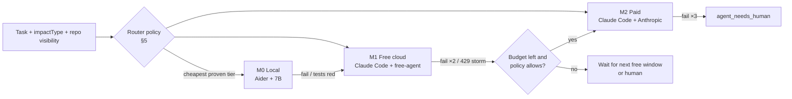
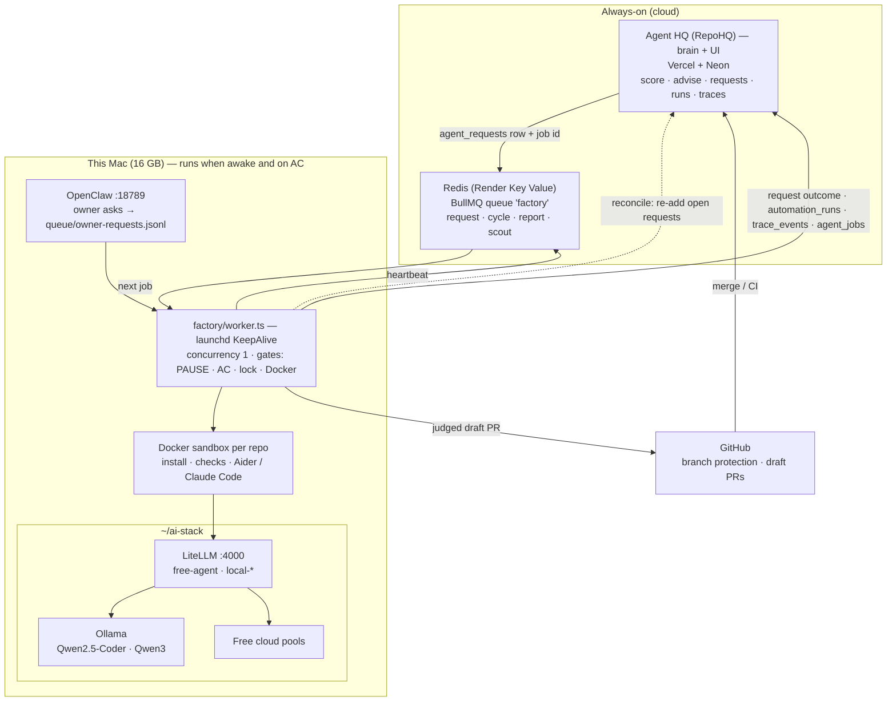

# RepoHQ — Personal Autonomous Software Factory

> **Status:** Phases 60–64, 68 and 69 shipped; 65–66 partial; 67 not started ([roadmap.md](roadmap.md#autonomous-factory-roadmap)).
> The local lane runs as `factory/`, a BullMQ worker kept alive by launchd (its job schedulers keep the old calendar: hourly overnight, 06:45 morning report); operator guide in [factory/README.md](../factory/README.md).
> Since 2026-10-07 it is the only executor: RepoHQ's "Run agent" queues into it and Nexus is retired (§15, [PRD](agent-hq-migration-prd.md)).
> Agent work lands as draft PRs against `main`; nothing merges without the owner (the `integration/agent` hop of roadmap Phase 70 was retired 2026-10-06).
> §12 records what building it changed, including the first scheduled night.
> Adapted from the *"Personal Autonomous Software Factory — Infrastructure Provisioning & Identity"* PRD (§21),
> reconciled with what RepoHQ, Nexus, gstack and the local AI stack actually do today, and
> re-prioritised around one constraint: **use free models wherever they're good enough.**

---

## 0. TL;DR

RepoHQ already runs a closed improvement loop: **score → advise → dispatch → execute → PR → measure → recalibrate**
(see [agentic-full-flow.md](agentic-full-flow.md)). Before this doc, every execution ran on **paid Claude** on a Render worker; the factory below now does that work on this Mac at $0.

This doc turns that loop into a **cost-aware autonomous factory**:

1. **A local worker lane on the Mac** executes most tasks against the local AI stack (`~/ai-stack`: Ollama → Headroom → LiteLLM), at **$0**.
2. **A model-tier ladder** (local → free cloud → paid) picks the cheapest model that has *proven* it can do each task type, and escalates on failure.
3. **The existing accuracy loop is extended to models**, so the system learns its own routing policy. That is self-improvement of the factory, as well as of the repos. It changes routing *data* only: the factory never edits its own judge, loop or router (§14).
4. **Trust, secrets, identity and budget guardrails** from the PRD get mapped onto existing RepoHQ primitives instead of a parallel system.
5. **Infrastructure provisioning** (the PRD's headline) is kept, but moved to Horizon 3. It's high-blast-radius and only pays off once the repo loop is cheap and trusted.
6. **Factory v2 (§14, Phases 75–80) shipped 2026-10-06:** repo code runs only in a Docker sandbox, a stronger judge plus an adversarial reviewer, capability stages (observe → report → pr), sensors and one ranked queue, the `agent_jobs` record with KPIs, and the night-shift policy. What's left is time: the night shift's gate of 7 consecutive fully-sandboxed nights. Target: one good, human-approved PR every night, then more.

---

## 1. What existed at the start (verified 2026-10-04)

This is the starting point the design was built on. For what the factory became, see §12 (first build), §13 (team roles) and §14 (Factory v2).

| Layer | Component | Where | State |
|---|---|---|---|
| Brain | **RepoHQ** (this repo): scoring, advisor, auto-dispatch, accuracy loop, MCP | Vercel + Neon | ✅ shipped (Phases 1–59) |
| Dispatcher | **Nexus** (`AI-Took-My-Job`): API + BullMQ queue `triage` | Render (web + Redis) | ✅ |
| Hands (paid) | Nexus worker → `scripts/gstack-*.sh` → `claude /skill --print` | Render worker, `ANTHROPIC_API_KEY` | ✅ (see bug note below) |
| Skills | **gstack**: `/health /qa-only /review /investigate /ship /qa /canary /document-release /retro` | `~/.claude/skills/gstack` | ✅ |
| Model gateway | **ai-stack**: Ollama :11434 → Headroom :8787 → LiteLLM :4000 (`sk-local-ai`) | this Mac, auto-start | ✅ all layers green |
| Local models | `local-coder` (Qwen2.5-Coder-7B), `local-coder-14b` (8k ctx), `local-qwen3` | Ollama | ✅ $0 |
| Free cloud | `cloud-or` (OpenRouter `nemotron-3-ultra-550b:free`) | LiteLLM | ✅ $0, rate-limited |
| Paid cloud | `cloud-smart` (Claude Sonnet) | LiteLLM | ✅ pay-per-use |
| Agent CLIs | Claude Code 2.1, Aider 0.86, OpenCode 1.18, OpenHands (on-demand) | this Mac | ✅ |
| Assistant | **OpenClaw** gateway :18789 + WhatsApp companion | this Mac, launchd | ✅ |
| Secrets | 1Password CLI `op` 2.33 | this Mac | installed, not wired |
| IaC | Terraform 1.5.7, `gh` (authed) | this Mac | installed |
| Agent identity (GitHub) | Nexus `GITHUB_AUTH_MODE=app` (GitHub App) | Render | ✅ (PRs come from the app) |

> **Bug found during this review (fixed with a regression test; merged in AI-Took-My-Job #19 and released to `main` in #23):** commit `1e9210e`
> ("remove OpenClaw") left the `claude --print` call *inside the `else` branch* of all nine
> `scripts/gstack-*.sh`. On any machine where `claude` is on `PATH`, which includes Render after
> `npm install -g @anthropic-ai/claude-code`, the skill never ran. Report-only skills then produced
> empty reports ("clean runs"). After the fix, `tests/integration/gstack-health-readonly-check.sh`
> passes with real findings.

### Spike: can free models drive the loop? (2026-10-04)

Same task each time: a seeded bug in `add()`, "read it, fix it, reply DONE".

| Harness → model | Path | Result | Time | Cost |
|---|---|---|---|---|
| **Aider → `local-coder` (7B)** | `OPENAI_API_BASE=localhost:4000/v1` | ✅ fixed | **8.7 s** (651 tokens) | $0 |
| **Claude Code → `cloud-or` (free)** | `ANTHROPIC_BASE_URL=localhost:4000` (LiteLLM `/v1/messages`) | ✅ Read → Edit tool loop, fixed | 65 s | $0 |
| Claude Code → `local-coder` (7B) | same | ❌ "Prompt is too long": Claude Code's system prompt + tools exceed 16k ctx | — | — |

Conclusions that drive the design:

- **LiteLLM's Anthropic-compatible `/v1/messages` endpoint means Claude Code + gstack can run on free models unchanged.** You set three env vars and touch no code.
- **Local 7–14B models can't host Claude Code** (context), but **Aider's lean prompts make them useful** for scoped, file-targeted edits.
- OpenRouter currently lists **19 free models with tool-calling** (`supported_parameters` ∋ `tools`). Slugs rotate, so the factory needs a *scout* (§6) and should never hard-code a slug.

---

## 2. Changes from the original PRD

| PRD section | Change | Why |
|---|---|---|
| §21 overall order | **Repo self-improvement first, infra provisioning later** (Horizon 3) | The value and the learning signal (PR merged → health delta) already exist for repos. Provisioning cloud resources is the highest blast radius and has no accuracy signal yet. |
| *(missing)* | **New §3: model-tier routing + cost ladder** | The PRD has budgets but no model strategy. Free-first is the core requirement. |
| *(missing)* | **New §4: data-classification policy** | Free cloud endpoints may log or train on prompts. Private-repo code shouldn't go there by default. |
| *(missing)* | **New §5: learned routing** | Turns the existing advisor-accuracy loop into a model-selection loop. That's the "self-improvement" with a real signal. |
| §21.4 four trust levels | **Kept; crossed with the existing task tiers** (Tier 1–3/Blocked) and environments | RepoHQ already gates by task tier. Action level and task tier are orthogonal and both are needed. |
| §21.4 Level 4 | **Exception: an agent may destroy what it created in the same run, tagged `ephemeral`, in dev** | Otherwise disposable environments (§21.13) need a human click on every teardown, which defeats them. |
| §21.14 VM architecture | **No VM on a 16 GB Mac.** A dedicated macOS user first, container later | A VM plus Ollama plus Docker (capped at 7.65 GB) doesn't fit. Unix-user isolation costs zero RAM. |
| §21.15 network isolation | **Deferred to the container phase**, plus a cheap rule now: worker reaches LiteLLM, GitHub, registries | Egress allowlisting on Docker Desktop needs a proxy, which is more memory. |
| §21.17 Director / PM / Architect agents | **Stages in one pipeline, not separate long-running agents** | Inter-agent chatter burns tokens. RepoHQ advisor = Director/PM; gstack `plan-*` reviews = Architect; Nexus = dispatcher. |
| §21.9 OpenClaw | **Re-admitted as the human channel + browser fallback, *not* the execution path** | Phase 58-G removed it from execution for good reasons (WebSocket gateway, local-only). It's now running locally and is ideal for WhatsApp approvals. |
| §21.11 budgets | **Add "no silent paid fallback" rule**; RepoHQ (Neon) is the budget ledger | LiteLLM's `local-coder → cloud-or → cloud-smart` ladder auto-spends on error. LiteLLM budgets need their own Postgres (no RAM for it). |
| §21.2 `.infrastructure/` folder | **Ledger lives in RepoHQ DB; the repo folder is a mirror** | One queryable source of truth across repos for cost, TTL and teardown. |
| §21.21 relationship | Updated with real components (§8) | |

---

## 3. Model tiers and the cost ladder

Every task is assigned a **model tier** before dispatch. The dispatcher always starts at the cheapest eligible tier.

| Tier | Harness → model | Cost | Good for | Not for |
|---|---|---|---|---|
| **M0 Local** | **Aider** → `local-coder` / `local-coder-14b`; direct LiteLLM calls → `local-qwen3` | $0, unlimited | README/doc sections, single-file fixes with a known target, commit/PR text, classifying findings, summarising CI logs | Anything needing repo exploration or tool loops; >16k context (8k for 14B) |
| **M1 Free cloud** | **Claude Code + gstack** with `ANTHROPIC_BASE_URL=http://localhost:4000` → alias `free-agent`, a **redundant pool across three free providers** (§3.1) | $0; each provider rate-limited, the pool isn't | gstack report-only skills (`/health /review /qa-only /retro`), Tier 1–2 `/ship` (docs, deps, CI/test fixes) on **public** repos | Private repos (default, §4); Tier 3 security; long-context refactors |
| **M2 Paid** | Claude Code → Anthropic (`cloud-smart` or direct key) | $ | Tier 3 (`/investigate` security), tasks that failed twice on M1, private repos where free is disallowed | Default path. **Never reached implicitly.** |

**The RepoHQ intelligence layer** (advisor, digest, CEO report, summaries) runs on Vercel and can't reach `localhost`. It gets its own free path:

- **Gemini free tier**: the existing `gemini` adapter already works with a free AI Studio key. Zero code.
- **OpenRouter free models** via a new OpenAI-compatible `openrouter` provider (base URL + model in settings). Locally the same provider can point at LiteLLM.
- Free models are worse at strict JSON. Every structured call gets **schema validation → one repair retry → fallback to `claude-haiku-4-5`**, and fallbacks are counted toward budget.

### 3.1 The free model pool: no single quota is a point of failure

A $0 OpenRouter account gets **50 free-model requests per day**, and one Claude Code task uses about 10–30. Building M1 on OpenRouter alone made the whole free tier stop after two tasks (it did, on day one). M1 is therefore a **pool** inside LiteLLM, spread across independent free providers, and every client goes through LiteLLM rather than talking to a provider directly:

```
          Factory (Claude Code / Aider)      OpenClaw agents      OpenCode · Aider · Continue
                       │                           │                        │
                       └───────────── Headroom → LiteLLM :4000 ─────────────┘
                                             │
        local-coder / local-agent ── Ollama on the M1 Pro ($0, unlimited) ← routine work
                                             │ error
        free-agent ── Ollama Cloud (free plan) ─429→ free-agent-b ── OpenRouter :free ─429→ free-agent-c ── Gemini (AI Studio free)
                                             │ all exhausted
        factory: defer to next cycle (never pays)        interactive / OpenClaw: cloud-smart (paid, last resort)
```

| Policy (owner's) | Alias | Where it runs |
|---|---|---|
| Routine: classify, summarise, read an error, small scoped edits | `local-coder` / `local-agent` | Ollama on the Mac, $0, unlimited |
| Medium: agentic coding, reviews, multi-file fixes | `free-agent` → `-b` → `-c` | Free pool: Ollama Cloud · OpenRouter · Gemini, chosen by the scout |
| OpenRouter | member of the pool | One provider among three, no longer the brain |
| Hard / production-critical | `cloud-smart` | Paid Claude: explicit choice, budget-gated in the factory, last resort for interactive use |

- **The scout picks members by eval, not by brand.** It discovers free candidates on each provider: Gemini models that answer right now (newest Flash models often return 503 "high demand" on the free tier); Ollama Cloud models available on the free plan *with tool calling*, probed per model since many are Pro-only; and OpenRouter `:free` models with `tools`. It runs the eval suite on each, ranks with 21 days of history, and fills the chain **best model first, then different providers** (`pickPool`). It doesn't re-test models evaluated in the last 3 days.
- **Fallback is LiteLLM's job, inside one request.** A 429 on one provider moves to the next without the caller noticing. Verified live: a request to quota-exhausted `cloud-or` came back from Ollama Cloud with `x-litellm-attempted-fallbacks: 1`. LiteLLM doesn't chain fallbacks recursively, so every ladder (`free-agent`, `cloud-or`, `local-coder`) is written out in full by the scout.
- **The factory only defers M1 when no member has capacity.** OpenRouter's quota is the only one it can read (`/api/v1/key`), so a pool with any other provider proceeds and relies on LiteLLM to fall through (`m1Deferred`).
- **OpenClaw** already talked to LiteLLM through Headroom. Its default agent is now `local-coder` → `free-agent` → `cloud-smart` instead of `local-coder` → `cloud-or` → `cloud-smart`. The companion agent stays on `cloud-smart` by choice.
- **Data policy is unchanged.** Every pool member is a free tier that may log or train on prompts (Google states this for the AI Studio free tier), so the §4 rule stands: only public repos reach M1 unless a private repo opts in.

### Escalation ladder



Each escalation carries the failed attempt's diff and test output as context, the same mechanism as the Phase 55 CI-fix loop.

### Rules

1. **No silent paid fallback.** Worker aliases (`free-agent`, `local-*`) have **free-only** fallbacks in LiteLLM. Only the dispatcher can pick M2, and only with budget.
2. **429 is "wait", not "escalate".** Free-tier rate limits reschedule the job with backoff. Escalating on rate limits would turn throttling into spend.
3. **Model is telemetry.** Every attempt records `{tier, harness, model, inputTokens, outputTokens, costUsd, durationMs}`.

---

## 4. Data classification

| Repo class | M0 local | M1 free cloud | M2 paid |
|---|---|---|---|
| Public | ✅ | ✅ | ✅ |
| Private (default) | ✅ | ❌ (opt-in per repo: `allowFreeCloud`) | ✅ |
| Private + flagged sensitive (secrets, client work) | ✅ | ❌ | ✅ (zero-retention account only) |

RepoHQ already stores `visibility` and `purpose` (e.g. `Client Work`), so the default needs no new input. Free provider terms change; the scout (§6) records each model's data-policy flag where OpenRouter exposes it.

---

## 5. Learned routing: the factory improves itself

RepoHQ already computes per-`impactType` accuracy (`advisor-accuracy-utils.ts`) from `portfolio_events`. Extend the key from `impactType` to **`(impactType, skill, tier)`**:

```
success(impactType, skill, tier) = merged PRs with actualDelta ≥ 0  /  attempts   (30-day decay, as today)
```

**Router policy** (pure function, `src/lib/agents/model-router.ts`):

1. Candidate tiers = tiers allowed by data policy (§4) and task tier (Tier 3 → M2 only, until M1 proves itself on Tier 2).
2. Pick the **cheapest tier with success ≥ 80% over ≥ 10 attempts**.
3. If no tier has enough data, start at the cheapest allowed tier (cold start is free).
4. **Exploration:** about 10% of eligible tasks are tried **one tier cheaper** than policy says. That's how the system notices a new free model got good. Capped so an exploration failure always has a cheaper retry budget.
5. Downgrade is automatic; upgrade-to-paid needs budget (§7).

This gives the PRD's "measure → learn → next mission" a concrete number: **% of merged improvements produced at $0**.

---

## 6. Model scout (weekly, $0)

Free slugs rotate (the ai-stack README already documents `cloud-or` 404s). A weekly local job:

1. `GET https://openrouter.ai/api/v1/models` → filter `pricing.prompt == "0" && pricing.completion == "0" && "tools" ∈ supported_parameters`.
2. Run a **fixed eval suite** through Claude Code via LiteLLM, extending today's spike:
   - seeded-bug fix (Read → Edit), multi-file fix with a failing test, `/health`-style JSON report against a schema, refusal to modify files under the read-only header.
3. Score = pass rate, then latency. Keep the top 2 as `free-agent` and `free-agent-b` (fallback) in `~/ai-stack/litellm/config.yaml`, then `docker compose restart`.
4. Post a `model_scout_report` event to RepoHQ, shown on `/agent-performance`.

Changing a LiteLLM alias is a Level 3 dev modification (§7): automatic, logged, and revertible via git in `~/ai-stack`.

---

## 7. Trust, approvals and budget

### Action levels × environment (PRD §21.4–21.5, kept)

| Level | Repo work examples | Infra examples (Horizon 3) | Dev | Prod |
|---|---|---|---|---|
| 🟢 L1 Read | clone, read CI, read alerts | list resources | auto | auto (where safe) |
| 🟢 L2 Create | branch, **draft** PR, report | dev project / DB branch | auto | approval |
| 🟡 L3 Modify | push to agent branch, update PR, mark ready-for-review, LiteLLM alias | env vars, config | auto within policy | approval |
| 🔴 L4 Destroy / irreversible | **merge to default branch**, delete branch/repo, force-push, repo settings, secret rotation | delete DB/project | approval* | approval |

\* Exception: resources the agent created **in the same run**, tagged `ephemeral`, in dev, may be torn down automatically.

**Task tiers stay** (architecture.md → Risk Tiers): Tier 1 docs → Tier 2 deps/CI → Tier 3 security → Blocked (features, auth, payments, migrations). A task needs **both** an allowed task tier and an allowed action level.

**Merging stays human.** All agent PRs remain draft-first. A future opt-in policy can auto-merge **Tier 1 docs PRs** on repos with green CI and ≥ 90% merge rate. Off by default.

### Capabilities, not credentials (PRD §21.16)

The worker never holds broad tokens. It gets a per-lane capability set:

```
github.read_repo  github.create_branch  github.push_agent_branch  github.create_draft_pr  github.read_ci
litellm.chat(model ∈ lane.allowedModels)
repohq.webhook(agent-events)
```

On GitHub this is the existing **Nexus GitHub App**, installed on selected repos with `contents:write` + `pull_requests:write` and branch protection on `main`. Branch protection is the hard backstop that makes L4 merges impossible without a human.

### Human boundary as a normal state (PRD §21.10)

New lifecycle stage **`awaiting_approval`** (alongside the existing `agent_needs_human`). Triggers: L4 action, budget exceeded, MFA/CAPTCHA/passkey, Tier 3 task, scout proposing a model with a changed data policy.

Delivery: RepoHQ bell (exists) → outbound webhook (exists) → **OpenClaw → WhatsApp**:

```
RepoHQ: RepoHQ#142 wants M2 (paid) — est. $0.40, month-to-date $3.10 / $10.
Approve: https://repohq.vercel.app/approve/<signed-token>
```

Approval goes through a **signed, single-use, expiring link** back to RepoHQ, never a free-text reply. *(Not built yet: the first `/approve` page was removed in the 2026-10 audit because nothing issued or consumed its tokens; see roadmap Phase 65.)* Chat replies can be spoofed or prompt-injected, and the OpenClaw companion shouldn't hold approval authority.

### Budget (PRD §21.11)

| Control | Enforced by |
|---|---|
| Hard monthly ceiling | **Anthropic console spend limit** (provider-side; the one cap that can't be bypassed by a bug) |
| Monthly / per-project / per-task budgets | RepoHQ ledger: workers report `costUsd` per attempt; dispatcher refuses M2 when month-to-date + estimate > budget → `awaiting_approval` |
| Daily free-request quota | Worker-side token bucket per free model; 429 → reschedule |
| Infra spend (Horizon 3) | Pre-provision estimate in the resource ledger; > per-project budget → approval |

---

## 8. Topology

As built (2026-10-07, roadmap Phase 81). The original plan routed work through Nexus lanes (a local and a Render worker); the factory became the executor instead, and Nexus is retired.



**Who decides what (PRD §21.21, updated):**

| Question | Answered by |
|---|---|
| What should we do? | RepoHQ advisor + health scoring |
| Which model/lane, at what cost? | RepoHQ router (§5) + budget ledger (§7) |
| Who runs it, where? | The factory worker on this Mac, one job at a time (requests first); paid tiers only in manual runs |
| How is it engineered? | gstack skills via Claude Code, or Aider for M0 |
| What environment is needed? | Infrastructure stage (Horizon 3, §10) |
| Is it allowed? | Action level × task tier × data policy |
| Does a human need to say yes? | `awaiting_approval` → OpenClaw → signed link |
| Did it work? | Judge v2 before the PR; CI on agent PRs flags `needs human` (Phase 55); merge → health delta → accuracy (Phase 52) |

### Later: the AI dev VM

When the Mac stops being enough, or isolation matters more than RAM, the whole worker stack moves into one VM and the Mac becomes the **control plane** (RepoHQ dashboard, approvals, owner's browser):

```
AI DEV VM: OpenClaw · Chrome · LiteLLM · Ollama · MCP servers · git · Docker · 1Password CLI (AI-Agent vault) · project workspace
```

The factory needs no change for that move. It already talks to everything through LiteLLM, keeps its state in one directory, and is deployed from a pinned checkout. On a 16 GB M1 Pro the VM can't also host local models, so this waits for more RAM or a separate box (ai-stack roadmap: hardware upgrade).

### Running locally on 16 GB

- **Isolation (phase 1):** a dedicated macOS user `ai-agent` runs the worker via launchd. It has its own `~/.claude` (gstack installed there), its own `gh` auth via the GitHub App token, and no read access to the owner's home. Zero RAM overhead.
- **Isolation (later):** a `node:22` container (`--memory 2g`, workspace volume only) once egress allowlisting is worth a proxy.
- **Concurrency:** M0 jobs = 1 (Ollama model resident); M1 jobs = 2 (only the Claude Code process is local). **Never alongside OpenHands or the 14B model.**
- **Availability:** jobs queue while the Mac sleeps. A nightly window (`pmset repeat wakeorpoweron`) when on AC drains the queue. `caffeinate -i` wraps active runs. M1-eligible jobs stuck > `localDeadlineHours` (default 48) stay queued and are **not** auto-promoted to paid.
- **Secrets:** `op run --env-file=worker.env -- node dist/worker.js` with a 1Password **service account** scoped to the `AI-Agent` vault. The model sees variable *names* (via the brief), never values (PRD §21.6–21.7).

---

## 9. The loop, end to end

As designed (2026-10-04):

```
[Sense]     6h sync → health, CI, alerts, deployments          (exists)
[Decide]    Monday advisor / daily gstack-self → actions        (exists)
[Route]     router: task tier × action level × data policy × learned success → tier + lane   (new)
[Execute]   local worker (M0 Aider / M1 Claude Code+gstack via LiteLLM) or Render (M2)        (new lanes)
[Verify]    tests + CI loop, ≤3 fix attempts on same branch     (exists, Phase 55)
[Gate]      draft PR · awaiting_approval for L4/budget · WhatsApp signed link                (new)
[Measure]   merge → resync → actualDelta + cost per tier        (exists + cost)
[Learn]     success(impactType, skill, tier) → router; scout refreshes free models            (new)
[Repeat]    next cycle starts from a higher baseline and a cheaper policy
```

As built (Factory v2, 2026-10-06):

```
[Sense]     gh sensors: red CI, Dependabot alerts, stale bot PRs → one ranked queue        (Phase 78)
            + each repo's own typecheck / lint / test, run in the sandbox
[Decide]    task kinds with an oracle, gated by capability stage observe → report → pr   (Phases 75, 78)
[Route]     cheapest proven tier per difficulty × data class                             (Phases 63, 79)
[Execute]   Docker sandbox: Aider (M0) / Claude Code (M1) via the egress relay           (Phase 76)
[Verify]    repo checks + Judge v2 rules, then an advisory adversarial review            (Phase 77)
[Gate]      draft PR → main; you merge                                                  (Phase 70, simplified)
[Measure]   agent_jobs + KPIs: overnight yield, acceptance, requests per merge, autonomy (Phase 79)
[Learn]     merge/close → routing data; wrong verdicts → judge regression fixtures        (Phases 63, 77)
[Schedule]  20:00–06:00 on AC power, sandboxed, $0                                        (Phase 80)
```

### Success metrics

| Metric | Target |
|---|---|
| Share of merged agent PRs produced at $0 (M0+M1) | ≥ 80% |
| Paid spend per month | ≤ configured budget (default $0; scheduled cycles always run at $0) |
| Overnight yield (merged PRs per night) | rising over 30 nights (Phase 80) |
| Merge rate, M1 Tier 1–2 | ≥ 75% (same bar as today's paid path) |
| Escalation rate M1 → M2 | trending down |
| Unapproved L4 actions | **0, always** |
| Abandoned agent-created resources (Horizon 3) | 0 past TTL |

---

## 10. Horizon 3: infrastructure agent (PRD §21.1–21.3, 21.12–21.13, 21.17–21.19)

Kept from the PRD, with these constraints:

- **Scope, in order:** GitHub repo (GitHub App) → Vercel preview project → Neon/Supabase **dev branch** → Cloudflare DNS for preview subdomains → AWS/GCP last.
- **IaC-first:** Terraform (installed) or provider-native config (`vercel.json`, Supabase migrations, GitHub Actions). Plan → review → apply to dev → test → commit IaC.
- **Resource ledger:** new `agent_resources` table: `{owner, repoId, provider, kind, externalId, environment, purpose, estMonthlyUsd, createdByTaskId, ephemeral, ttlAt, destroyProcedure, state}` with lifecycle `requested → approved → provisioning → active → modified → deprecated → destroyed`. Mirrored to `.infrastructure/resources.json` in the repo.
- **Disposable environments:** create → test → preview → QA (gstack `/qa` with the browse daemon) → PR → destroy, using the "destroy what you created" exception (§7).
- **Mission mode** (PRD §21.19, "build a construction expense tracker"): office-hours → plan-ceo/eng review → provision dev → scaffold → QA → PR. This is feature work, which is **Blocked** for autonomous execution today. It unlocks only after Tier 1–3 hit their accuracy gates. Every mission starts in `awaiting_approval` with a cost estimate.

---

## 11. Security principle (PRD §21.20, kept verbatim in spirit)

> The agent gets enough authority to accomplish its mission, and never more.

**Model intelligence ≠ system trust**, and free models widen the gap: they're weaker *and* run on providers with looser data terms. So every guarantee in this doc is enforced **outside the model**:

- branch protection, not "please don't merge"
- signed approval links, not chat replies
- worktree revert in report-only scripts, not the read-only prompt header alone
- provider-side spend limit, not prompt instructions
- capability-scoped tokens, not admin keys
- the data-class gate before dispatch, not after

---

## 12. What building it changed (2026-10-05)

The first implementation ran against all ten allowlisted repos. These findings changed the design above:

| Finding | Evidence | Change |
|---|---|---|
| **Free cloud is quota-bound, not just rate-limited.** A $0-credit OpenRouter key gets 50 free-model requests/day *per account*; one Claude Code task uses ~10–30. | `GET /api/v1/key` → `free_model_daily_requests: {used: 79, limit: 50}` after one scout run | M1 checks the remaining quota before each task and defers below 25. The scout evaluates only what the day's quota allows and accumulates evidence across runs. Cheapest scale-up: a one-time $10 OpenRouter credit (1,000/day). |
| Shared free pools also throttle per model upstream | 429 "temporarily rate-limited upstream" on Gemma 4 | Preflight ping per candidate; throttled cases excluded from ranking |
| M0 is good at small scoped edits, bad at large files | Seeded bug fixed in 6.8s; a 37KB README came back as 376 tokens (whole-file format), then timed out with diff format | Aider runs with `--edit-format diff`; files over 12KB skip M0; M0 timeout 4 min |
| Weak models write plausible but wrong docs | M0 deleted a Features list, invented `npx prisma`, wrote `github.com/yourusername` | README judge: additive-only, scripts and `npx` tools must exist, placeholders rejected. Prompt includes the real repo URL |
| Repo checks can mutate the tree | Figma-Jira's `lint` is `eslint . --fix` (1,239-line diff with no model involved) | Baseline side effects are discarded; after a fix, autofix output is folded into the judged diff, so what's judged is what ships |
| Cheap failures must not lock out capable tiers | Two M0 README failures would have dead-ended the task for M1 | Dead ends count M1+ failures only |
| Restarting LiteLLM drops in-flight agent calls | An Aider run hung 15 min during a scout reload | Scout and cycle share a process lock |
| launchd jobs can't read `~/Documents` (macOS TCC) | Scheduled run failed: `factory.sh: Operation not permitted` | `install-launchd.sh` deploys the committed HEAD to `~/.repohq-factory/app` (outside the owner's workspace); the sink's DB secret moves to the login keychain |
| Background launchd priority starves the checks | `ProcessType=Background` made `npm ci` take 4.5 min and RepoHQ's own tests fail | Standard priority (`Nice 5`); every failing check is re-run once and only reproducible failures become tasks |
| **One free provider is a single point of failure** | OpenRouter's 50/day was gone after one scout run; every M1 task deferred | M1 became a pool across Ollama Cloud (free plan), OpenRouter and Gemini (§3.1). A request to the exhausted provider now falls through within the same call |
| "Offload Claude Code's background calls to local" saves nothing headless | `modelUsage` showed only the main model; pointing the small-model role at a non-existent alias still passed, with 0 requests for it in LiteLLM | `local-small` kept as insurance. The real request cost is one per agent turn (11–19 per task), so the levers are the provider pool and fewer turns |
| Free tiers expose different models than their catalogues list | Gemini 3.5–3.8 Flash: 503 "high demand"; 2.5 Flash: retired for new users. Ollama Cloud: 11 of 16 models Pro-only | Discovery probes each candidate (one tiny call) before it's evaluated |
| Not every README is documentation | gitHub-cron-job-app's README is a cron heartbeat file | Removed from the allowlist. The allowlist is the owner's statement of intent. |
| **Injected context leaked into commits** | Nexus's gstack scripts wrote the RepoHQ brief (with a "Last push" timestamp) into `CLAUDE.md`; 12 open agent PRs across 6 repos contained *only* that change and conflicted with each other | AI-Took-My-Job #19: the brief is stripped by an EXIT trap before anything is committed. `CLAUDE.md` back to `@AGENTS.md` (Github-HQ #12) |
| Agent branches escaped the release policy | Nexus names branches `nexus/agent-task-*`; the policy matched `nexus/auto-*`, so agent PRs targeted `main` | Policy matches `nexus/*` and `factory/*`; factory branches follow the `feature/bot/…` standard and target `integration/agent` when a repo has it |
| A Mac on battery doesn't run overnight | Deep Idle sleep stretched a 10-minute cycle to 3 hours and a verified fix was lost to a failed push | `caffeinate -ims` (AC only), push / PR creation retry on network errors, overnight runs documented as needing power |
| A lint script that fixes files can't host model fixes | Figma-Jira's `eslint --fix` rewrite is 2,493 lines; every model fix exceeded the size cap | New deterministic `lint-autofix` task lands the fixer's own rewrite first; deps PRs discard check side effects |
| The judge can be wrong too | family-tree keeps scripts in `client/` and `server/`; README attempts on two tiers were rejected for "invented" scripts that exist | Scripts and deps are read from sub-package `package.json` files; verdicts later shown to be judge bugs are marked `voided` (kept for history, ignored for routing) |
| A prepaid seat still runs out | Copilot Pro's premium requests hit 0% (overage off): the CLI answered "You have no quota", logged as a model failure | The factory reads the Copilot quota before builder tasks and review requests and pauses both until the reset; "no quota" counts as rate-limited |

**First scheduled night (2026-10-05 → 06):** 3 draft PRs from one verification cycle (AI-Trend-Tracker lint, an `npm audit fix` on AI-CLI-Social-Autoposter, and a go-adventure test "fix" that was closed in review: it skipped key-dependent smoke tests via early returns, which the judge now rejects). The owner merged 3 factory PRs, giving the router its first merge signal. Overnight cycles then opened AI-Trend-Tracker #6 (a real Vitest config fix) despite the sleep problems above.

**First live PR (scheduled run, 2026-10-05):** [AI-Took-My-Job#10](https://github.com/smithdavedesign/AI-Took-My-Job/pull/10), produced by M0 (local Qwen2.5-Coder 7B) at $0. It adds an Installation and Setup section (+30/−0) with the real clone URL and real scripts. It also documented `npm test` for a repo without a test script, which the judge now rejects.

First sweep (dry run, 10 repos): RepoHQ and AI-CLI-Social-Autoposter green; real failures in Open-Travel (lint), AI-Trend-Tracker (lint + tests), go-adventure (tests), Figma-Jira (lint), ai-brand-context (tests); README gaps in several. All M1 work was deferred that day on quota, with nothing escalated to paid.

## 13. Toward an AI engineering team

The owner's target is a small team rather than one agent: **Architect** (thinks, decides, reviews), **Builder** (codes), **Reviewer** (independent, tries to break it), **Operator** (OpenClaw: browser, cloud, infra). They exchange structured handoffs instead of chatting. Status:

| Role | Implemented as | Why this way |
|---|---|---|
| Director | Promotion ladder: each capability's stage (observe → report → pr) and the evidence to promote it, in the morning report | The factory earns autonomy capability by capability; only the owner changes a stage |
| PM / Architect | Sensors + one ranked queue across repos (red CI > security > failing checks > docs, weighted by health); router per difficulty | Deterministic and cheap; no model decides what to work on |
| Builder | M0 Aider (local) · M1 Claude Code on the free pool · M2 Claude (paid, budget-gated), all in the Docker sandbox · MC Copilot CLI (host-only, so skipped while sandboxed) | Cheapest proven tier first, escalating on failure; repo code never runs on the host |
| QA | The judge: the repo's own checks re-run, plus Judge v2 rules (test integrity, type escapes, diff sanity, imports, coverage) and an 18-case regression suite | Rule-based checks beat model agreement as verification |
| Reviewer | Advisory adversarial review by a different model family on every verified change (labels; may veto once promoted) + GitHub Copilot code review on PRs while premium requests last | It can only find reasons not to merge, never approve |
| Investigator | `red-ci`: sandboxed root-cause reports for failing CI on the base branch, in the morning report | Report first; fixes only once its reports hold up |
| Security | `npm audit` on every scan + deterministic `deps-audit` fixes; Dependabot alerts sensor | No model needed |
| Ops | Night shift policy (AC power, sandbox, $0), readiness gate, KPIs and trend | Measures the factory, not just the models |
| Operator | Not yet (Horizon 3) | Needs trust levels, approvals and the resource ledger first; CLIs/APIs before browser clicking |

**Rules carried over from the design discussion:**
- Handoffs are structured (task JSON in, verdict JSON out), never open-ended chat. OpenClaw's `maxPingPongTurns` is pinned to 1 for when agent-to-agent is enabled.
- Agent-to-agent access is explicitly locked down before any new agent is added (§ roadmap Phase 69). When the team agents arrive, the allowlist is architect↔builder, architect↔operator, reviewer→architect. The reviewer never holds production credentials; the builder never holds the vault.
- The morning report is the team's standup: one section per gstack role, numbers from the ledger only.

## 14. Factory v2: one good PR while the owner sleeps (2026-10-06)

A proposal for a "Director + many specialist agents" architecture (CEO, engineering, QA, security and release agents spawning each other) was reviewed against what the factory had actually run and taught us. Its revised form is the plan of record. The full proposal isn't reproduced here; this section keeps the decisions.

**North star.** Not "a team of autonomous agents" but *an autonomous software factory that safely produces one high-quality, human-approved PR at a time, continuously*. The metric the whole project optimises: **how many human-approved improvements the factory produced overnight.** Then raise it from one to two to three, and raise the share that get merged.

**Why not more agents.** The binding constraints, in order, are verification, free-model requests, the owner's review time, then local compute. More roles add output that nothing can verify mechanically, and a 9-skill chain costs ~9 agent sessions per task on a free pool that affords one or two pipelines a night (§12). So effort goes into the boxes of the loop that already exists:

```
sense → select one task → fixed pipeline → sandboxed worker → verify (deterministic) → judge (advisory) → draft PR → human merge → learn (data only)
```

### 14.1 Decisions

| # | Decision | Concretely |
|---|---|---|
| 1 | **Sandbox before intelligence** (shipped, §14.3). The worker was too trusted: `npm ci` and test suites of target repos run on the owner's Mac with `gh`, keychain and `~/.ssh` in reach | Docker job container per repo (Phase 76). The **container gets no GitHub credential at all**: the host already commits, pushes and opens the PR *after* the judge passes (`factory/lib/git.ts`), so the container only needs the repo copy, the LiteLLM endpoint and the package registry. No host mounts, no Docker socket, CPU/memory/time limits, destroyed after the job. Checks run *inside* the container too, since the untrusted code is the repo's install and test scripts, not just the model |
| 2 | **Spawning depth = 1.** Director → worker → done | Workers return a structured result; they never pick the next step. Nexus's `suggestedNextSkill` auto-chain (one hop, behind `autoDispatchEnabled`) is the pattern this rules out for unattended work; it was removed with Nexus (Phase 81) |
| 3 | **Fixed pipelines per task kind**, chosen by the Director; no dynamic skill chains | Pipelines map to task kinds with an oracle, not to gstack skill names (Phase 78). gstack `/qa` drives a browser against a running app, not a failing unit test; `/benchmark` needs baselines none of the repos have; a feature pipeline has no oracle, so it stays report-only |
| 4 | **Deterministic verification first; the LLM judge last and advisory** | The rule-based judge (`verify.ts`) gets harder to fool (Phase 77). An adversarial LLM pass ("prove this should not merge") runs only after the rules pass, on a different model family from the builder, and can only **veto or flag** `UNCERTAIN`, never approve. `UNCERTAIN` = a PR label asking for a careful human read, not a block |
| 5 | **The factory never modifies its own judge, loop or router** | Shipped 2026-10-06: in the factory's home repo (Github-HQ is on its own allowlist), the judge rejects any diff touching `factory/**` or `src/lib/agents/model-router.ts`; the Autonomous PR policy workflow fails autonomous branches that touch them, as a backstop. Changes there are human-only |
| 6 | **Learning changes data, not code** | Merge / close / judge-reject / human-edit outcomes adjust routing statistics. Self-modification of factory code is out of scope indefinitely |
| 7 | **Coarse routing** | Task difficulty (simple / medium / hard) × tier (local / free cloud / Copilot / paid). No per-skill × model × repo cells until there are thousands of jobs; today a cell needs ≥ 10 attempts to count |
| 8 | **Promotion ladder per capability**: observe → report → draft PR → auto-verified PR → human merge | A new capability (e.g. red-CI investigation) enters at *report* and moves up only with evidence. **Merge stays human indefinitely**: it's the final control and the router's best learning signal |
| 9 | **Measure what the factory costs, not just what the model scores** | KPIs in Phase 79: accepted PRs per free request, merge rate, review-load proxies, autonomy |
| 10 | **Keep scheduled one-shot cycles** rather than a `while (!paused)` daemon | launchd starts a fresh process each cycle: crashes and leaks don't accumulate, `PAUSE` is checked at start, and "nothing worth doing" already means the cycle exits. Same loop shape, more robust host. Phase 81 kept this inside the BullMQ worker: it is a thin supervisor that checks `PAUSE` before each job and runs every job in a fresh child process |
| 11 | **Owner requests enter through the front door, not a second worker** (2026-10-06) | OpenClaw turns a plain-words ask into a queued task (`queue/owner-requests.jsonl`); the factory consumes it as the `owner-requested` task kind through the *same* path — sandbox → free-pool → judge → draft PR → ledger. It's free-form so it has no oracle (nuancing decision #3): acceptance is the judge's **generic gate** (checks still pass, nothing regresses, diff ≤ budget, no forbidden/CI/secret edits, no test gutting) plus a draft PR labeled `owner-requested` for human review — never auto-merged. Depth stays 1; prompt-injection in a request still only yields a sandboxed, judged, human-reviewed draft PR. Contract + code pointers: `ai-stack/repohq/CONTRACT.md`, `factory/lib/owner-requests.ts`. Since Phase 81 RepoHQ's "Run agent" comes through the same door as an `agent_requests` row (`factory/lib/agent-requests.ts`) |

**Status (2026-10-07):** all eleven are in code (Phases 75–81). #2's last exception, Nexus's auto-chain, went with Nexus in Phase 81. #10: concurrency stays 1 until the night-shift gate passes.

### 14.2 KPIs

| KPI | Definition | Source |
|---|---|---|
| Factory efficiency | accepted (merged) PRs ÷ free-model requests spent | ledger: request count per attempt (new field) |
| Acceptance | merged ÷ (merged + closed) factory PRs | reconcile (exists) |
| Review load (proxy) | median hours from PR open to merge/close; human commits pushed onto bot branches | GitHub (new) |
| Autonomy | verified tasks ÷ tasks that ended in `approval_needed`, dead-end or a human edit | ledger |
| Overnight yield | human-approved PRs produced per night | ledger + reconcile; headline of the morning report |

"Minutes of human review" can't be measured directly, so the proxies stand in for it.

### 14.3 The sandbox as built (Phase 76)

Shipped 2026-10-06; operator details in [factory/README.md "Sandbox"](../factory/README.md#sandbox).

```
host:  clone (gh) ─▶ tar ─▶ ┌ worker (no creds, no mounts, non-root, caps dropped) ┐ ─internal net─▶ ┌ egress ┐ ─▶ npm/yarn registries
                            │ install · checks · Aider / Claude Code · re-checks   │               │ proxy  │
host:  judge ◀─ patch ◀──── └──────────────────────────────────────────────────────┘               │ relay  │ ─▶ LiteLLM (allowed models only)
host:  commit · push · draft PR                                                                     └────────┘
```

What building it decided:
- **Overrides-only environments.** `run()` used to take a full environment and every caller spread `process.env`. Now `env` holds overrides, the host runner merges them and the sandbox runner forwards exactly those, so host secrets such as `FACTORY_DATABASE_URL` can't reach repo code by construction (unit-tested).
- **A model allowlist at the relay, not only a host allowlist.** LiteLLM's key is a fixed, published default, so "reach LiteLLM" meant "reach the paid alias too". The relay reads each request's `model` and forwards only the factory's free aliases. The same gap exists for anything on the host that can reach `localhost:4000`; the Anthropic console spend cap (Phase 60) is still the provider-side backstop.
- **The host judges its own copy.** The worker's result comes back as a patch and is applied to the host clone before the judge runs, so the judged tree, the committed tree and the pushed tree are one tree. Only file contents cross the boundary; git hooks never run (`--no-verify`).
- **Skip, don't degrade.** Docker down means no cycle, not a host run.
- **Measured cost:** ~3 s per repo to create the network, egress and worker; isolation smoke 8 s; the e2e cycle 34 s sandboxed vs 25 s on the host. Images: worker 1.8 GB, egress 235 MB.

### 14.4 Phases 75, 77–80 as built (2026-10-06)

Operator details: [factory/README.md](../factory/README.md) ("Judge v2", "Promotion ladder", "Sensors and the queue", "KPIs and the job record", "Night shift"). Decisions #3–#9 in §14.1 are now in code; the night shift's 7-clean-nights gate is counting.

| Finding | Evidence | Change |
|---|---|---|
| **The reviewer found a hole the rules didn't have** | Live test: the seeded e2e type error "fixed" with `as any` passed every deterministic rule; both reviewers (`free-agent`, `local-qwen3`) failed it with quoted evidence and passed the honest fix | New deterministic rule (no new `any` casts in source for type/lint fixes) plus a regression fixture. What the reviewer catches repeatedly should become a rule, which is free and certain |
| Evidence quoting needs normalising | `free-agent` quoted diff lines with their `+` markers, across two lines; the substring check dropped a correct issue | Markers are stripped from both the quote and the diff before matching; invented quotes are still dropped |
| Reproducing a failure can rewrite files | The first red-CI investigation (Figma-Jira) ran the repo's `eslint --fix` and was failed for "editing files", though its report was right | Investigations discard file changes and are judged on the report; nothing from them ships either way |
| A queue bonus outranked real work | A never-scanned repo (50 + age bonus 21) ranked above failing checks (60) | Age bonus capped at 8.75 points, below the 10-point gap between categories (unit-tested invariant) |
| **Old bot PRs block most repos** | First live sense: 5 of 9 repos have bot PRs unreviewed for 7+ days, mostly the pre-fix Nexus no-op PRs | Working as designed: no new factory PRs there until they're handled. Closing them is the owner action with the biggest yield effect |
| Dependabot is off everywhere | `dependabot/alerts` → "disabled" on 9/9 repos | Reported as an owner action instead of being read as "no alerts" |
| Per-kind routing would take months to learn | ≥ 10 attempts per kind × tier; 22 attempts in total so far | Routing per difficulty (simple/medium/hard). Deterministic fixes and investigations are excluded: they'd credit M0 with `npm audit fix`'s success |
| A schema push could carry drift | `db:push` applies every difference between schema and database | `agent_jobs` DDL generated by drizzle-kit, wrapped in `IF NOT EXISTS`, applied by `npm run factory:migrate` (ran twice, no change the second time) |
| Battery nights stall | §12: a 10-minute cycle took 3 hours on battery | Scheduled cycles skip on battery, refuse to run unsandboxed, and run at $0 whatever the manual budget |

### 14.5 Capacity on this Mac

16 GB RAM: Docker Desktop's VM has 8 GB and Ollama keeps a 7B model (~5 GB) resident on the host. Realistic concurrency is **one container**, two for light repos. The cycle is serial, and stays serial until the sandbox has run a week of nights cleanly.

## 15. One agent system (2026-10-07, roadmap Phase 81)

RepoHQ had two executors that wrote code: the factory, and Nexus (AI-Took-My-Job: paid Claude on a Render worker, no sandbox, no judge). The owner chose one. The factory is now the only thing that writes code; Nexus's infrastructure (the BullMQ queue on Redis, the worker deployment) moved into this repo and its code did not. Full write-up: [agent-hq-migration-prd.md](agent-hq-migration-prd.md).

- **Front door:** RepoHQ (UI, Monday auto-dispatch, MCP) writes an `agent_requests` row and adds a BullMQ job; OpenClaw's JSONL requests are mirrored into the same table. Neon is the record and Redis only wakes the worker.
- **Worker:** `factory/worker.ts` under launchd `KeepAlive` replaces the cycle/report/scout calendar with job schedulers. Requests (priority 1) run ahead of cycles. Environment problems defer a request, never fail it.
- **Skills:** fix (`/ship`, `/qa`, `/document-release`) and report (`/investigate`, `/review`, `/qa-only`, `/health`, `/retro`) modes. `owner-requested` stays at stage `report` until the owner promotes it, so fix requests end `verified` rather than as PRs until then.
- **Visibility:** `automation_runs` and `trace_events` give every job and cron a step timeline, shown on the Agents page with the worker's heartbeat, the queue and owner controls.
- **Removed:** the Nexus dispatch and webhook, skill auto-chaining, and the CI-fix loop on open agent PRs.

---

_Related: [architecture.md](architecture.md) · [agentic-full-flow.md](agentic-full-flow.md) · [roadmap.md](roadmap.md#autonomous-factory-roadmap) · local stack docs: [smithdavedesign/ai-stack-docs](https://github.com/smithdavedesign/ai-stack-docs)_
